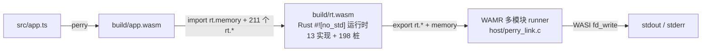

# 把 TypeScript 编译成 WebAssembly 并在无 JS 引擎的宿主上运行

**探索 perry 编译为 wasm 的可能性，以及途中发现的性能异常与修复**

**Compiling TypeScript to WebAssembly and Running It on a Host Without a
 JavaScript Engine:
A Systematic Exploration from Runtime Modularization through Performance
 Attribution to an Upstream Compiler Fix**

**作者：** Adam
**日期：** 2026-09-21
**材料来源：** 本仓库 `docs/`、`tools/`、`src/`、`host/`、`runtime-wasm/` 的一手实测记录；
上游仓库 [PerryTS/perry](https://github.com/PerryTS/perry)、
[fn-a/typerry](https://github.com/fn-a/typerry)、
[bytecodealliance/wasm-micro-runtime](https://github.com/bytecodealliance/wasm-micro-runtime)。

---

## 中文摘要

TypeScript 程序的分发和交付长期等同于交付源码：打包与压缩只增加阅读成本，不改变语义可读性。
编译成原生二进制能解决源码外流，却把"一次编写、到处运行"换成"一次编写、到处编译"，交叉编译矩阵随平台数量增长。WebAssembly 提供了第三条路。
本文记录一次完整的技术探索：把 perry 编译器产出的 TypeScript→wasm 模块运行在**没有任何 JavaScript 引擎**的宿主上，
宿主只保留 WASI 的 `fd_write`。

探索分三段。
第一段先解决"能否运行"：把 perry 的 Rust 运行时以 `#![no_std]` 编译成独立的 wasm 模块，
由 WAMR 多模块机制与业务模块链接，业务模块的 211 个 `rt.*` 导入全部由该模块提供，其中 13 个真实实现、198 个编译期生成的报错桩；
正负向用例 6/6 通过，输出与 perry 自带 JS 宿主层逐字节一致。
第二段要处理的是途中发现的性能异常，也就是"慢在何处"：用同一份 `src/bench.ts`（fib(29) 加 10⁶ 次循环）建立六路对照，
把总倍数按**乘积因子**分解为「引擎因子 × codegen 因子」并做闭合校验（误差 <5%），用手写"干净对照 wasm"隔离引擎，
用 V8 的 TurboFan 稳态与 QuickJS 旁证交叉验证。
结论不在引擎一侧：干净 wasm 在 WAMR AOT 下与手写 C 同速（0.97×），根因是 perry wasm codegen 的类型擦除——
`+` 与条件判定被改写为桥接调用（bridge call），桥接函数体占 AOT 方法耗时的 95.8%。
第三段据此回到"如何修、修到何种程度"：先做零上游依赖的 wat 后处理 pass（4 程序 × 7 变体共 28 次逐字节一致、0 误判、
bench 快 7.3×），再直接修改上游 `perry-codegen-wasm` 的发射点，
结果是 **122.112 ms → 3.891 ms（快 31.4×）**，跨过等价手工特化的上界 17.185 ms，逼近无包装的表示的 3.325 ms。

**关键词：** WebAssembly；TypeScript 编译器；运行时模块化；性能定位；类型特化；WAMR

---

## English Abstract

TypeScript delivery has long meant source delivery.
 Bundling and minification raise reading cost but leave semantics legible.
 Compiling to a native binary solves source exposure but trades "write once,
 run anywhere" for "write once, compile everywhere",
 and the cross-compilation matrix grows with every platform.
 WebAssembly offers a third path.
 This paper reports a complete exploration:
 running perry's TypeScript-to-wasm module on a host with
 **no JavaScript engine at all**, where the host retains only WASI `fd_write`.

The exploration has three stages.
 The first establishes feasibility:
 perry's Rust runtime is compiled as a standalone `#![no_std]` wasm module,
 linked with the application module through WAMR's multi-module mechanism;
 all 211 `rt.*` imports of the application are supplied by that module,
 13 with real implementations and 198 with compile-time-generated trap stubs.
 All six demo steps pass,
 with byte-identical output against perry's bundled JavaScript host layer.
 The second stage locates the cost:
 six execution routes run the same `src/bench.ts` (fib(29) plus a 10⁶-iteration
 loop),
 and the total slowdown is factored **multiplicatively** into an engine factor
 and a codegen factor with closure checks (error below 5%).
 A hand-written "clean" wasm isolates the engine;
 V8's TurboFan steady state and QuickJS provide independent cross-validation.
 The engine is not at fault:
 clean wasm under WAMR AOT runs at native speed (0.97×),
 while the root cause is type erasure in perry's wasm codegen,
 which forces `+` and conditions across a dynamic-dispatch bridge whose function
 body accounts for 95.8% of the AOT route's runtime.
 The third stage asks how far a fix can go, building on that finding:
 a zero-upstream-dependency wat post-processing pass (28 byte-identical
 comparisons across 4 programs × 7 variants, zero false positives,
 7.3× on the benchmark) is followed by a direct patch to the upstream
 `perry-codegen-wasm` emission sites,
 yielding **122.112 ms → 3.891 ms (31.4×)**,
 past the equivalence hand-specialization ceiling of 17.185 ms and close to the
 fully unboxed 3.325 ms.

**Keywords:** WebAssembly; TypeScript compiler; runtime modularization;
 performance attribution; type specialization; WAMR

---

## 1. 引言

### 1.1 交付 TypeScript 意味着交付源码

TypeScript 编译成 JavaScript 之后仍是可读文本。打包、压缩、要不要附带 source map，影响读起来的难易程度，不改变语义的暴露程度。
对业务逻辑即核心资产的场景来说，这个问题长期无解：产物即源码。

编译成原生二进制更彻底，代价也清楚：产物与操作系统、CPU 架构、ABI 绑定，每个组合都须单独构建一份，交叉编译矩阵随平台数量线性膨胀。
对第三方分发的库或插件来说，"到处编译"的成本常常高过它换来的收益。

WebAssembly 是第三条路：产物是平台无关的字节码，只分发一次；运行只需要一个 wasm 运行时，于是"到处运行"由运行时侧提供，不必让编译器侧穷举。

### 1.2 两个研究问题

perry 的 wasm 后端让这条路看似可行，但产物形态随即引出一个疑问。
perry 输出的并非"纯算法模块"，而是一个完整程序：导出 `_start` 与 `memory`，程序入口在启动时把全部业务逻辑执行完毕。
它同时声明了 **211 个 `rt.*`
 导入**，覆盖字符串、console、Math、JSON、Date、Map/Set、Buffer、crypto 等运行时能力；**无论程序是否用到，
实例化时都要求可解析**。
perry 自带的宿主层是一套 JavaScript 实现，其代码注释点明了设计取向：
*Runtime operations (strings, console, objects) are imported from JavaScript.*。

这决定了本文要回答的两个问题：

- **RQ1（源码保护）**：产物里是否只剩字节码，不含可读的源码语义；
- **RQ2（到处运行还剩多少）**：这 211 个导入所代表的运行时语义，是必须由每个平台各自重写一遍，还是可以随 wasm 一同分发。

RQ2 是关键。若运行时只能由宿主逐个实现，"到处运行"就退化成"到处写一套运行时"，源码保护的收益也随之下降：分发物从源码换成字节码，运行时部分仍维持原状。
RQ1 要简单些，但答案有所保留，见 3.1 与 8.4。

本文的论点先行陈述：这条路可行不可行、慢不慢，可以分开测量；
代价拆成引擎与 codegen 两部分，换到 AOT 后引擎那部分归零，剩下的几乎全在 codegen 产出的指令形态上——不在 WebAssembly、
也不在引擎。路线图也由此清楚——第 3 章先完成运行验证；
验证途中出现的性能异常把问题引到代价一侧，第 4 章评估代价，第 5 章把代价拆到可闭合校验，第 6 章回到源头修，第 7–8 章给边界与效度威胁。
每一步的数字都带测量口径，凡材料标为推断的，本文保留同等标注。

### 1.3 本文的贡献

下面五条按探索顺序排列：1–2 完成运行验证，3–4 评估代价与定位，5 修复。
1. **一条已完成运行验证的架构路线**：把 perry 的 Rust 运行时按 wasm 目标编译成独立模块，由 WAMR 多模块机制与业务模块链接，
    宿主只剩 WASI 的一个调用（3.2–3.4）。`rt.*` 的调用约定、业务代码、codegen 均未改动。
2. **一套 `rt.*` ABI 的逆向方法**：在没有规范、但有可运行参考实现时，把参考实现当 oracle 插桩，而不是读源码猜（3.3）。
3. **一套可复用的性能改进方法**：把总倍数拆成乘积因子、用手写的干净对照 wasm 隔离引擎、做闭合校验、再用独立引擎交叉验证（第 5 章）。
    它不停在"wasm 比原生慢 N 倍"这一步，而要拆出这 N 倍里哪一部分属于引擎、哪一部分属于 codegen。
4. **对自建基线的自审**：`gcc -O2` 的深度自内联使 1,664,079 次逻辑调用只发生 91,759 次真实 call，
    审计用 gdb 断点与 callgrind 双证纠正了这一口径错误（4.4）。
5. **两种修复与其定量验证**：零上游依赖的 wat 后处理 pass（6.2）与上游 codegen 发射点特化（6.3），
    后者把 AOT 方法的耗时从 122.112 ms 降到 3.891 ms。

### 1.4 材料与方法声明

本文不引外部文献。素材全部来自本仓库的一手实测记录与上游公开仓库，属"作者提供自有素材"的情形：方法学在既有材料上展开，不经系统文献检索，也不编造参考文献。
所有数字都带测量口径（样本数、统计量、扣除项、机器）；凡材料中标注为推断的数字，本文保留同等标注。

---

## 2. 背景

### 2.1 perry 与 typerry

[perry](https://github.com/PerryTS/perry) 是用 Rust 写的 TypeScript/JavaScript 编译器，
前端用 SWC 解析，后端基于 LLVM，主要产物是原生可执行文件。
它的 wasm 后端被单独抽取，发布成 npm 包 [`@typerry/node`](https://github.com/fn-a/typerry)，
链路是 SWC → 自研 HIR → wasm codegen，经 napi-rs 暴露给 JavaScript，零运行时依赖。

两条后端对"运行时"的处理方式不同，这也是本文所有问题的源头：

- **native 后端**：`crates/perry-runtime` 是 Rust 写的运行时（GC、JSValue、内置对象、字符串），
  `crates/perry-runtime-static` 把它构建为 `libperry_runtime.a`，
  `perry compile` 直接把这个静态库链进可执行文件。运行时不是宿主契约，它本身就是源码。
- **wasm 后端**：运行时操作声明为对宿主的导入。
  perry 这么设计是为了产出"自包含 HTML + base64 wasm"（把运行时委托给 JS 宿主层），211 个导入、
  "每个宿主都得实现一遍"就是这么来的。

本探索涉及的版本：WAMR 2.4.3，构建需 `WAMR_BUILD_MULTI_MODULE=1`、`WAMR_BUILD_LIBC_WASI=1`、
`WAMR_BUILD_TARGET=X86_64`；
perry 预编译 release v0.5.1520（`perry-linux-x86_64.tar.gz`，解压前 624,641,943 B、
解压后 2.2 GiB，sha256 `3423d9fe…f952`）；
上游 wasm 后端源码取自 vendored perry，commit `87ecb02b`。

### 2.2 WAMR 与 WASI

[WAMR](https://github.com/bytecodealliance/wasm-micro-runtime)（WebAssembly Micro
 Runtime）是 C 实现的嵌入式 wasm 运行时，同时提供解释器（含 FAST_INTERP 字节码翻译模式）、AOT 产物加载器，以及多模块链接能力。
本探索用到其中三件事：多模块链接（一个模块的导入由另一个已注册模块提供）、AOT（`wamrc` 把 wasm 编成机器码）、WASI 支持。

WASI 在本探索里的作用缩减至最小：运行时模块不带 libc，
标准输出与错误只用 `wasi_snapshot_preview1.fd_write` 一个调用。
宿主只要调用 `wasm_runtime_set_wasi_args`，运行时模块的 `fd_write` 就映射至 stdio。

### 2.3 相关工作定位

本文不引外部文献，这里只交代技术坐标系。
放置运行时有三条路：留给宿主（perry wasm 后端的默认形态）、静态链进同一模块（perry native 后端，
以及 wasm 侧尚未实施的"路线二"）、编成独立 wasm 模块交由多模块机制链接（本文路线三）。
Component Model 能给出第四种更干净的表达（用 WIT 声明 `rt` 接口），但它与本文"f64 位模式 + 线性内存槽位"的零拷贝约定冲突，
且 WAMR 侧支持较弱，本探索未实施。坐标既定，下面把第三条路接成一条能跑的链路，路上的限制一并记下。

---

## 3. 系统构造

### 3.1 perry wasm 产物形态

先看产物本身。perry 的 wasm 是一个完整程序：

```
Export:  _start / memory / __indirect_function_table / ...
Import[211]:
func[0] sig=1 <rt.string_new> <- rt.string_new
func[1] sig=2 <rt.console_log> <- rt.console_log
...
```

211 个导入均绑定于 `rt` 模块。也就是说，宿主要让它运行，就必须将这 211 个函数全部提供，哪怕真正会被调用的只有三个。
这 211 个不是按程序需要声明，而是 perry 一次铺开的固定接口面——任何
perry 编译的 wasm 都带这套导入，与程序用没用无关。其能力按
导入名前缀分布，下面是 198 个桩的逐族计数（来源 `build/rt_symbols.rs`，
即 `tools/gen-rt-symbols.mjs` 从导入段生成的符号表）：

| 导入名前缀 | 桩 | 导入名前缀 | 桩 |
|---|---:|---|---:|
| `array_*` | 28 | `date_*` | 12 |
| `string_*` | 17 | `url_*` | 10 |
| `buffer_*` | 13 | `set_*` | 10 |
| `object_*` | 12 | `map_*` | 10 |
| `math_*` | 12 | `class_*` | 9 |
| `closure_*` | 7 | `crypto_*` | 4 |

其余分散在 `searchparams_*`/`response_*`/`path_*`（各 6）、`uint8array_*`
（5）、`promise_*`（3）及 `json_*`/`fetch_*`/`regexp_*`/`process_*` 等更小族。
13 个真实现分属 `string_*`/`console_*`/`js_*`/`is_*`/`mem_*`（清单见附录 C）。

RQ1 的答案有一部分是肯定的。
查 `app.wasm` 的段表，
**没有 name 自定义段**（只有 type / import / func / table / memory / global / export /
 element / datacount / code / data 共十一段），函数名与局部变量名都不在产物里；
`strings` 能提取出的标识符全是程序自己的字符串字面量。
泄漏的是字面量和导入名，其中导入名这一项并不轻：198 个桩的名字（`array_new`、`json_parse`、`fetch_url` 等）
直接来自导入段，同时标明了程序会触及哪些运行时能力。所以源码保护成立，但门槛只是从"打开源码"抬到"反编译一遍再读"。

### 3.2 运行时模块化：三条路线

前文提到的三条路线，按改动量排序：

| 路线 | 做法 | 状态 | 代价 |
|---|---|---|---|
| 一·C 桥接 | 宿主里用 C 手写 `rt.*`，编成 `libperry_rt.so`，`iwasm --native-lib` 动态载入 | 已实施为探针，后废弃为历史背景 | 成本随程序用到的语言特性线性增长 |
| 二·AOT 内联 | `wasm-ld` 把运行时 wasm 静态库与 codegen 输出链成单模块（同构于 native 路径）；或走 Component Model | 未实施 | 需 codegen 产出可重定位对象，或链接器把 import 解析成本地符号；Component Model 则与零拷贝约定冲突 |
| 三·运行时 wasm 模块 | 运行时编成独立 wasm 模块，导出同名 `rt.*` 与 memory，业务模块 import 它，WAMR 多模块链接 | **当前实现，已实测** | 运行时的 OS 强耦合模块需裁剪（见 3.5） |

路线一是探针，不是终点。它测定了 ABI，也证明了"每个平台重写一遍运行时"这条路不可行：13 个手写实现只够支撑纯原始值的程序，程序一用数组立刻报错。

路线三的构件如下：

- `runtime-wasm/`：Rust `#![no_std]` 运行时，`crate-type = ["cdylib"]`，
  release 用 `opt-level = "s"` + `lto = true` + `panic = "abort"` +
   `codegen-units = 1` + `strip`；`src/lib.rs` 620 行；
  自定义 `panic_handler` 指向 `trap()`。
- `.cargo/config.toml`：`--global-base=2097152`，
  把运行时自己的 data/bss/stack 置于 2 MiB 以上，避开业务模块的低地址区。
- `tools/patch-app-memory.mjs`：
  把业务模块的 memory 段改成 `import rt.memory`（默认 `min=1` 页），因为同一块线性内存只能有一个定义者。
- `tools/gen-rt-symbols.mjs`：解析 `app.wasm` 导入段（手写 uleb 解析 types/imports），
  源文件里已定义 `rt_<名字>(` 的只登记进符号表，其余生成"调用即报错"的桩。

生成的符号表是编译期产物，不是运行时查表：

```
build/rt_symbols.rs: 211 个 rt 导入 (已实现 13, 桩 198)
```

桩被调用时先往 stderr 写实名报错，然后 trap，绝不静默返回假数据。
这是个刻意选择：静默返回 `undefined` 会让程序携带错误数据继续运行，实名报错至少使边界明确可见。

13 个真实实现覆盖 string（new/len/eq/concat/to_string）、
number 与 bool 的 NaN-box 值（以 f64 的 NaN 载荷区装载值、带标签的 64 位表示；
已装入该表示的值称「包装的」）、plus、console（log/warn/error）、以及动态分派（`mem_call`/`mem_call_i32`）。

**这条路为什么可行**：211 个 `rt.*` 签名只用到 i32/i64/f32/f64，指针就是业务线性内存里的偏移，跨模块不存在"类型不匹配"这一层；
运行时模块 import 业务那块内存之后，`mem_call`/`string_new` 直接读写同一块内存，零拷贝约定原样成立。

### 3.3 `rt.*` ABI 的逆向：把参考实现当 oracle

`rt.*` 的调用约定是 perry 内部约定，没有文档。不过 perry 自带一套宿主层，那 211 个函数的定义是现成的。

方法简明：在宿主的 `mem_call` 实现里插一行打印。

```js
const coreFn = __memDispatch[name];
// 上面插一行:
process.stderr.write(`MEMCALL ${name} args=${JSON.stringify(args)}\n`);
```

插桩立刻给出事实：

```
MEMCALL js_add args=[6764,4181]
MEMCALL js_add args=["fib(0..19) sum = ",10945]
MEMCALL console_log args=["fib(0..19) sum = 10945"]
```

一个 20 行程序真正用到的导入只有 `string_new`、`mem_call`、`mem_call_i32` 三个；
所有动态调用（字符串相加、console 输出、`.length`）都收敛到 `mem_call` 这一个入口，剩下 200 多个导入在实例化时被解析，
此后不再被调用。

方法论可概括为：**没有规范、但有可用的参考实现时，应借助插桩取证，而非阅读源码推测**。
最初想从 wat 反推参数含义，审视 `i64.const 9223090561878065386` 半小时没有结论；插一行 print，两分钟就清楚了。

由此得到的 ABI 事实：

- **值编码是 NaN-boxing**，i64 里装 f64 位模式，高 16 位是标签：

| 值 | 位模式 |
| --- | --- |
| `undefined` / `null` / `false` / `true` | `0x7FFC…0001` ~ `0x7FFC…0004` |
| 对象/数组/闭包（handle） | 高 16 位 `0x7FFD`，低 32 位是 handle id |
| int32 快路径 | 高 16 位 `0x7FFE` |
| 字符串 | 高 16 位 `0x7FFF`，低 32 位是字符串表下标 |
| 其他 | 就是普通 double |

- **字符串表是隐式契约**：wasm 启动时按固定顺序逐个调用 `rt.string_new(offset, len)` 注册字面量，
  宿主必须按同样顺序 append，下标即 id；两边计数错一位，字符串就全乱。桥接函数名也在这张表里，`mem_call` 的第一个参数就是名字的下标。
  运行时侧的表是 `MAX_STRINGS=1024` 条、`ARENA_SIZE=64 KiB`，条目为 `{ptr, len, utf16}`，
  其中 `utf16` 是 JS `length` 所需的 UTF-16 码元数。
- **动态调用协议是 `mem_call(nameId, argc, base)`**：参数以 u64 槽位写在业务线性内存 `base` 处，
  返回值也写回 `base`（函数本身返回 0.0 占位，宿主层源码注释说明了这点）；
  `mem_call_i32` 同理，只是结果直接作为 i32 返回，不写内存。至于为什么不直接按 f64 传参、要绕一趟内存，源码没有解释；
  本文作者的判断是 f64 过 FFI 边界时 NaN 位模式有被规范化的风险，两边都按 u64 读写原始位模式最稳妥。这条判断属于推断，文档里没有给出依据。

### 3.3.1 rt.* 的层次与 mem_call 分派内幕

先回答一个自然疑问：这 211 个函数为什么不做成 WASI？两者不在同一层。
WASI（preview1）是系统调用级接口——`fd_write`、`clock_time_get`、
`random_get`、`path_open`，形态统一成"(指针, 长度, …) → errno"，操作对象
是字节缓冲与资源句柄。`rt.*` 给的是**语言运行时**：字符串表、NaN-boxed 值
的编解码、对象/数组的 handle store，外加一个按名字动态分派的 `mem_call`
入口。WASI 里既没有"字符串"这个概念，也没有堆对象、属性与原型链。
两处硬冲突：
其一，211 个签名只描述位宽（`string_len: (i64) -> i64`、
`console_log: (i64) -> ()`），i64 里装的是 f64 位模式加高 16 位标签，
wasm 类型系统只看到 i64，看不到"这是字符串 id 还是 number"——WASI 的
强类型加资源语义套不上这套私有编码；其二，动态分派靠运行时按名查表，
不是编译期定死的符号导入。所以准确说法不是"不能 WASI 兼容"，而是
**WASI 在 `rt` 的下面一层**：`rt` 是语言运行时，WASI 是系统调用。本 demo
里运行时模块的 console 输出最终落到底层的 `fd_write`，正是这个层次关系
的直接验证（见 3.4）。

那么 211 个导入在运行时怎么被用？§3.3 的插桩已给出一个反直觉的事实：
真正被 call 的导入只有 `string_new`、`mem_call`、`mem_call_i32` 三个。
原因是 perry codegen 把所有动态操作（`+`、条件判定、`===`、字符串拼接、
console 输出、`.length`）统一发射成 `mem_call(nameId, argc, base)` 或
`mem_call_i32(...)`，而不是直接 `call` 各导入名（codegen 证据见
`tools/attribution/rt_fast/probe_nameid.md`：`BinaryOp::Add =>
emit_memcall(func, "js_add", 2)`，if/while/for 条件
`emit_memcall_i32(func, "is_truthy", 1)`）。于是出现一种"双重存在"：
`console_log`、`js_add`、`string_eq`、`is_truthy` 等 10 个操作，在 `rt.wasm`
里既作为直接导出函数存在（满足实例化时的导入解析——211 个少一个都不行），
又作为 `BRIDGES` 常量表（`runtime-wasm/src/lib.rs`，10 个名字）的条目，
由 `mem_call` 内部按名字分派到同一份实现。直接导出在运行时几乎不被
call，它的职责是让导入段可解析；真正执行走的是 `mem_call` → `BRIDGES`
→ 同一函数体。

`mem_call` 的分派路径（`runtime-wasm/src/lib.rs` 的 `invoke()`）如下：先按
`nameId` 查 `NAME_CACHE`（`[u8; 64]`，0xFF = 未缓存）直取桥索引，命中即
跳过扫描；未命中则按 `nameId` 取字符串表里对应的名字字节串（§3.3 字符串
表契约），再对 10 项 `BRIDGES` 逐项 `memcmp` 线性匹配，命中后回填缓存。
参数从业务线性内存 `base + i*8` 处按 `u64::from_le` 读出、`decode` 成内部
`V` 枚举；结果 `encode` 回写 `base`（`mem_call`）或直接作 i32 返回
（`mem_call_i32`）。`NAME_CACHE` 是 2026-09 采纳的优化：消除热路径上对
10 项 `BRIDGES` 的按名线性扫描（见 4.4 的 nameId 缓存直查）。查不到名字
的 `nameId` 走 `perry_rt_unimplemented` 路径：写 stderr 实名报错后
`unreachable()` trap——与 198 个桩的处置一致（见 3.2）。

### 3.4 多模块链接与 WASI-only 宿主



宿主 `host/perry_link.c` 的顺序是 load rt → register → set_wasi_args → load app →
 instantiate，之后用 `wasm_application_execute_main` 跑 `_start`。
**整个文件没有一行 `rt.*` 的实现**，这是它与路线一最本质的区别。

实测结果：`./demo.sh` 6/6 步 PASS，正向输出与 perry JS 宿主层逐字节一致（5 行）；
负向用例（用数组的 TS 程序）报 `bridge function 'array_new' is not implemented`，退出码 1。

```
fib(0..19) sum = 10945
Hello, WAMR!
msg.length = 12
string compare ok
template: Hello, WAMR! (sum=10945)
```

```
Exception: bridge function 'array_new' is not implemented
execute _start: Exception: unreachable
```

产物尺寸：`app.wasm` 10650 B、`app_link.wasm` 10658 B、
`rt.wasm` 16798 B（采纳 nameId 缓存后为 16928 B，见 4.4）、
宿主 runner `build/perry_link` 531336 B。

### 3.5 工程发现：WAMR AOT 不支持 import memory

性能实验需要 AOT 引擎，这一步遇到 WAMR 的一条文件格式限制：**AOT 产物不支持 import memory**。
`core/iwasm/compilation/aot_emit_aot_file.c` 硬编码
 `import_memory_count = 0`（留了 TODO 注释），
加载时 `core/iwasm/aot/aot_validator.c` 直接拒绝（"import memory is not supported"）。

后果是：现有双模块结构（app import rt.memory）**无法整体 AOT**，
`app.aot + rt.aot` 一同运行立刻报 "out of bounds memory access"。
混载方案（iwasm CLI 下 app.wasm 解释执行 + rt.aot）可运行，因为 AOT 子模块自己不 import memory，
但业务代码仍被解释执行，对性能没有意义。

可行的 AOT 形态是 `wasm-merge`（binaryen）把 app 与 rt 合并成单模块再交给 `wamrc`。
合并产物有两个坑，靠后处理脚本 `tools/attribution/patch_merged.mjs` 解决：

1. 合并产物导出了 rt 的 `__data_end`/`__heap_base`（1129776），与 app 的栈指针 global（65536）
    被 WAMR loader 组合成非法 aux stack（报 "auxiliary stack underflow"），必须删除这两个导出；
2. 合并后 `_initialize` 无人调用（原多模块形态由 WAMR 负责），
    必须织入 `_start` wrapper 先调 `_initialize`。

还有一个副作用：合并单模块在多轮 `wasm_application_execute_main` 下，
第 4 轮起报 "string table overflow"（rt 字符串表跨轮累积），解释器跑同一合并模块同样复现。
这是合并形态带来的多轮限制，双模块原形态没有这个问题，所以 E 路计时改用每轮独立进程。

### 3.6 实施中记录在案的七个坑

下面七个坑按发现顺序记录；它们的修法多沉淀成了后面的构造约束。

| # | 现象 | 根因与修法 | 备注 |
|---|---|---|---|
| 1 | `rt.string_new` 按 `u32,u32` 声明与业务模块 `(i32,i32)` 签名对不上 | 曾需 `wasm-abis=3`；仓库现无该痕迹，签名对齐靠 Rust 类型本身（`string_new` 用 `u32`，其余桥接函数用 `i64` 传 NaN-box 值） | [INFERENCE] |
| 2 | `perry_rt_unimplemented` 在产物里找不到，桩调用链接失败 | Rust ≥1.70 起 cdylib 只导出 `pub` 的 `#[no_mangle]` 符号；修法 `#[no_mangle] pub extern "C" fn` | — |
| 3 | 实例化报 `failed to link import memory (rt, memory)`、退出码 1 | 业务模块 import 的 memory `min` 超过 WAMR 对运行时模块记录的有效初始页数；实测 min=1 能过，min=2~100（含 17/18/64）全部失败，故默认 `min=1` | — |
| 4 | 报 `initializing thread failed!` | 与 `wasm_runtime_set_wasi_args` 调用时机有关；本 WAMR 2.4.3 构建未开 WASI 线程支持，**未复现** | 条件性 |
| 5 | 跑完输出后尾部多余空行，或初始化执行两遍 | `execute_func("_start")` 与 `wasm_application_execute_main` 的差异；统一用后者 | — |
| 6 | 编译报多余右花括号 | 调试清理残留，删除即可 | — |
| 7 | shell `sed` 多行插入导致函数体错乱 | `\n` 转义序列被错误解析；改用脚本做精确字符串替换，之后机械修改一律走脚本 | — |

第 3 条与第 4 条说的是同一件事：多模块链接的约束不止在 wasm 语义层，WAMR 自身的模块记录与初始化顺序同样构成契约。

---

## 4. 性能评估方法学

架构验证通过之后，跑出来的数字立刻显出性能异常，问题也随之变成"代价是多少"。
本章的组织顺序与常见的基准章节相反：先说对照怎么设计、测量纪律如何，再给结果，最后讲**本文如何审计自己的基线**。
这最后一步产出了全篇影响最大的一次修正——它没有改任何数字，只改了数字的读法。

### 4.1 基准程序与六路对照

基准程序 `src/bench.ts` 只有 20 行：递归 `fib(29)` 加一次 10⁶ 次求和循环。

```ts
function fib(n: number): number {
  if (n < 2) return n;
  return fib(n - 1) + fib(n - 2);
}
const N_FIB = 29;
const N_LOOP = 1000000;
const f = fib(N_FIB);
console.log("fib(" + N_FIB + ") = " + f);
let sum = 0;
for (let i = 0; i < N_LOOP; i++) { sum += i; }
console.log("sum = " + sum);
```

选它有两个理由。一是**调用密集**：fib(29) 产生 1,664,079 次逻辑调用，正好把"跨语言边界的调用成本"置于显微镜下。
二是**结果可校验**：两端都输出 `fib(29) = 514229`、`sum = 499999500000`，可以在计时之前先做逐字节一致性检查。

六路对照共享同一份源码与同一组常量：

| 路 | 宿主 / 引擎 | 说明 |
|---|---|---|
| A | WAMR FAST_INTERP | perry wasm 模块 + rt.wasm 双模块，解释执行 |
| B | Node V8 | perry wasm 模块 + perry 自带 JS 宿主层 |
| C | 手写原生 | `gcc -O2`，i64 实现（`tools/bench_native.c`） |
| D | perry 原生 | TS → LLVM → 可执行文件 |
| E | WAMR AOT | `wamrc` O3，wasm-merge 合并单模块（rt 代码也进机器码） |
| F | QuickJS | Bellard qjs 解释执行同一算法的 JS 版本 |

各条对照的设计意图有层次：C 给出"这块硬件能有多快"的地板，D 回答"perry 自己的两条后端差多少"，E 回答"换成 AOT 引擎后还剩多少差距"，
B 与 F 提供**独立引擎**的参照系。F 尤其重要，它刻意避开 wasm 和桥接调用，只回答一个问题：纯解释器跑同样的算法要多久。

### 4.2 测量纪律

测量口径的要点如下（CI 环境见附录 F.9）：

- **环境**：AMD Ryzen 7 5800H（8C16T，max 4.47 GHz），24 GiB RAM，Linux 6.17.13-2-pve，
  gcc 11.4.0，Node v24.21.0，rustc 1.95.0，WAMR 2.4.3。
- **解释器配置经实证**（`.deps/wamr-build/CMakeCache.txt`）：`WAMR_BUILD_INTERP=1`、
  **`WAMR_BUILD_FAST_INTERP=1`**、`WAMR_BUILD_AOT=0`、`WAMR_BUILD_JIT=0`、
  `WAMR_BUILD_MULTI_MODULE=1`、`CMAKE_BUILD_TYPE=Release`，即 FAST_INTERP 字节码翻译模式、
  无 AOT、无 JIT。
- **AOT 配置**：同上加 `WAMR_BUILD_AOT=1` + `WAMR_BUILD_WITH_CUSTOM_LLVM=1`，
  链接系统 LLVM 14 供 JIT 内联 stub；
  wasm→机器码由 `wamrc` 完成（wamrc 2.4.3 用系统 LLVM 14 构建，默认 O3/znver3）。
- **时钟**：A、C 用进程内 `clock_gettime(CLOCK_MONOTONIC)`（毫秒）；
  B 与全部冷启动用 bash 内建 `time`（`TIMEFORMAT=%3R`，本机无 `/usr/bin/time`）。
- **样本**：稳态每目标 11 轮**交错执行**（A B C × 11），丢弃第 1 轮 warmup，取 10 个样本，报 P50 与最小/最大值；
  冷启动各 5 次取中位数。
- **正确性先于计时**：A/B/C 输出逐字节一致性校验是 `bench.sh` 的第 2 步，排在全部计时之前。

各路的计时方式随产物形态而变，这一点本身也值得写清楚：

- **D 路**：perry 产物没有多轮入口，单次执行 ~6 ms 又低于 bash `time` 分辨率，
  因此用 `bench_perry_wrap.c` 对整个进程 fork/exec + waitpid 计时。
  数字包含进程启动 ~0.6 ms（空载基线 fork+exec+`/bin/true` P50 0.568 ms），口径对 D **偏保守**。
- **B 路**：计时含 node 进程启动，已减去 `node -e ''` 空跑基线（优化前 23 ms、优化后 24 ms）。
- **E 路**：合并单模块的多轮限制（见 3.5）迫使它每轮独立进程，每进程内 1 次预热 + 1 次计时，12 进程弃第 1 轮取 11 样本；
  E′ 无状态，与 A 同为进程内 11 轮。
- **A 路**：`bench_time` 内 `wasm_application_execute_main` 可重复执行，计时行来自进程内时钟，
  实例化开销单独输出 `INIT_MS`。

### 4.3 结果

优化采纳后的主批（稳态，毫秒）：

| 目标 | P50 | 最小 | 最大 | ÷C 原生 |
|---|---:|---:|---:|---:|
| E. WAMR AOT（perry wasm，合并单模块） | 146.829 | 143.097 | 158.074 | 104.4× |
| E′. WAMR AOT（干净 wasm 对照） | 1.362 | 1.317 | 1.409 | 0.97× |
| A. WAMR 解释器 | 2470.678 | 2378.375 | 2527.101 | 1757.2× |
| B. Node V8（扣除启动 24 ms） | 1280.000 | 1246.000 | 1311.000 | 910.4× |
| C. 原生 gcc -O2 | 1.406 | 1.357 | 3.092 | 1× |
| D. perry 原生（进程级，含启动） | 6.286 | 5.946 | 7.306 | 4.5× |

优化前（同一台机器、同一口径，rt 为按名扫描版）：A = 4009.746 ms（3866.041 / 4499.434），B = 1239.000 ms，
C = 1.471 ms；倍数 A = 2725.9×、B = 842.3×。
前后对比：A 路 4009.746 → 2470.678 ms（−38%），codegen 因子 79× → ~49×，总倍数 2726× → 1757×。

六路总表（含后增的 F 路）：

| 路 | P50 | ÷ C 原生 | ÷ D perry 原生 |
|---|---:|---:|---:|
| A. wasm × WAMR 解释器 | 2470.678 ms | 1757× | 393× |
| B. wasm × V8 | 1280.000 ms | 910× | 204× |
| C. 手写原生 gcc -O2 | 1.406 ms | 1× | — |
| D. perry 原生（进程级，纯执行 ~1.6–2.6 ms） | 6.286 ms | 4.5×（纯执行 1.2–1.9×） | 1× |
| E. wasm × WAMR AOT（复测批 138.736 / 148.709） | 146.829 ms | 104× | 23×（vs D 纯执行 56–92×） |
| F. QuickJS 直跑 JS（进程级，qjs 空载 ~0.95 ms） | 85.532 ms | 61× | 14×（进程级） |

F 路的拆分与倍数：P50 85.532 ms，其中 fib 部分 61.7 ms（37 ns/层）、loop 部分 24.8 ms（24.8 ns/迭代）；
F/E = **0.58×**（F 用时为 E 的 0.58×，快 42%）、F/E′ ≈ 62×、F/A = 0.035×（F 快 29×）。

冷启动（进程启动到输出完成，real 中位数 / 最小，毫秒）：A 4879 / 4836（`bench_time` 固定先跑 1 次预热再计时，
real 含两次执行；
单次 ≈ 4879 − 2471 − 7 ≈ 2401 ms），A 的 `INIT_MS` 6.883 / 8.042（双模块加载/注册/实例化，不含计算），
B 1224 / 1202，C 3 / 3，D 6 / 6。
优化前 A real 7836 / 7685（单次 ≈ 3819 ms），`INIT_MS` 6.728 / 6.344。

### 4.4 对自建基线的审计

结果得出后有一条质疑：原生基线 1.471 ms 在物理上可疑，按 1,664,079 次调用均摊，每层递归只摊到 0.6–0.9 ns，这在物理上不可能。
这条质疑指向的正是基准方法本身。

审计用三条独立证据核查。

**证据一：多编译器交叉验证。** 同一 `bench_native.c` 在 gcc -O1/-O2/-O3/-Ofast/-Os 与 clang -O2 下
 P50 分别为 3.604 / 1.471 / 1.240 / 1.296 / 2.337 / 2.170 ms。
五种独立编译管线聚在 1.2–3.6 ms 同一数量级；若有病态折叠，应出现离群值。

**证据二：指令计数闭合检验**（callgrind 实测）：

| 编译 | 单次执行指令数 | 静态 call 点 | P50 | IPC（@3.0 GHz） |
|---|---:|---:|---:|---:|
| gcc -O2（基线） | 16.71 M | 4（2 克隆体） | 1.471 ms | ~3.8 |
| gcc -O1（对照） | 28.13 M | 2 | 3.604 ms | ~2.6 |

IPC 3.8 对简单整数短依赖链合理。若 gcc 跨 `printf` 合并了两次 fib 调用，每轮指令增量会减半，而实测每轮增量恒为 16.71 M；
`fib(29)` 的 1,664,079 次逻辑调用由计数器实证（`fib_count.c`，gcc -O2 下 count = 1,664,079，
输出不变）。

**证据三：拆分计时**（`bench_split.c`，gcc -O2）：
fib 部分 P50 0.84 ms + 循环部分 0.30 ms ≈ 1.13 ms，
与整体 1.47 ms 吻合（差额为两次 `clock_gettime` 与 `printf`）。这是 `bench_split.c` 的一次独立拆分；
5.3 中用作引擎因子分母的同形原生拆分是 1.47 ms = fib 0.967 + 循环 0.50 ms（另一口径），两组量级一致、不要求互等。
同型 f64 变体（`bench_f64.c`，与 perry NaN-box 的 f64 位模式同语义）P50 2.52 ms；
C 基线用 i64 是公平下界，f64 版慢 ~1.8×，量级不变。

**结论：计时数字成立，物理矛盾来自 `gcc -O2` 对 fib 的深度自内联。** 1,664,
079 次"逻辑调用"只发生 **91,759 次真实 call**，由两个独立实测互相印证：
gdb 断点在 warmup+1 个 RUN 上命中 183,519，除以 2 次顶层执行得 91,759；
callgrind 调用图上 fib 与内联克隆体 fib'2 的入口合计同为 183,519。
`fib_O2.asm` 显示 161 条指令内含 4 个 call 点与 2 个克隆体，平均一次真实 call 覆盖约 18 层逻辑调用。
按真实 call 折算：fib 部分 0.84 ms / 91,759 ≈ **9.2 ns/真实 call**（≈27 cycles @3 GHz）。

质疑者的物理直觉用在"真实 call"上完全正确，错在把逻辑调用数当成了真实调用数。
这条修正的意义超出这条基线本身：**原生基线执行的动态指令量远少于 wasm 路径在同语义下的指令量**，"1757×"里有一部分是代码形态差异，
而不是全部都由解释器与桥接调用的运行时代价构成。
第 5 章的乘积分解已把这一点计入引擎因子的分母一侧（干净 wasm × WAMR 35×），无需改数，但在呈现上必须按因子乘积来读。

审计同时记录了两条来自开发过程的教训：

1. **编辑器事故**：基准开发中 `src/bench.ts` 曾丢失 `const f = fib(N_FIB)` 一行，
    导致 WAMR 路打印 `fib(29) = undefined`，排查中先排除了 rt.wasm 桩表与 codegen 路径，
    最后确认是源码编辑问题。教训是输出一致性校验必须先于计时。
2. **`gcc -O2` 会把整个基准常量折叠**：初版 `bench_native.c` 直接用 `#define` 常量，
    实测 0.002 ms（折叠后只剩 `printf`）；
    改经 `volatile` 指针读入 `N_FIB`/`N_LOOP` 后得到真实的 1.5 ms。
    **原生基线必须防止常量折叠，否则倍数会虚高三个数量级。**

### 4.5 本轮审计的修正汇总

性能数字不是一次成型。2026-09-21 的审计批针对三处质疑逐项复现，并新增 F 路，修正如下：

| 项 | 旧值 | 新值 | 依据 |
|---|---|---|---|
| B′ 干净 wasm × V8 | 4.9 ms | **3.40 ms**（`--no-liftoff`）；默认 4.67 仍对 | `run_node_steady.mjs` 阶梯预热 |
| B 路 V8 引擎因子 | ~3.3× | **~2.5×** | 3.40 ÷ 1.471 |
| B 路 codegen+宿主层因子 | ~253× | **~364×** | 1239 ÷ 3.40 |
| B 路乘积闭合校验 | 3.3×253 ≈ 835 | **2.5×364 ≈ 910**（误差 <0.1%） | 闭合 |
| D 纯执行 | 无（6.286 进程级） | **1.6–2.6 ms** | callgrind 19.44 M Ir 换算 |
| D/C（纯执行） | 4.5× | **1.2–1.9×** | 同左 |
| E/D | 23× | **56–92×**（按 D 纯执行） | 同左 |
| 合并模块成本 | 未测 | **无额外成本** | 解释器跑合并 2340–2390 vs 双模块 2372–2480 ms |
| wamrc 优化级 | 声明默认 O3 | **确认默认 O3**，O0 对照 390 vs 141 | `wamrc --help` + 实测 |
| F 路 QuickJS | 无 | **85.532 ms**（进程级） | `bench_f.sh` 11 轮 |
| E 路每次桥接调用成本 | ~27.5 ns | **rt 函数体 25.4 ns + NaN-box 开销 1.4 ns** | `nohost_box` 隔离实验 |

其中"合并模块无额外成本"决定了 E 路的可信度：同一份合并模块输入解释器 iwasm，进程级 real 三测 2390 / 2381 / 2340 ms，
双模块同口径 2480 / 2372 ms，`bench_time` 双模块进程内 RUN 2501–2527 ms。
合并版不慢于双模块，E 路没有被合并本身高估。
callgrind 在这里不可用：解释器构建含 `wrgsbase`（fsgsbase）指令，VEX 3.18 未实现，直接 SIGILL。
这处限制与结论无关，但在方法上必须记录。

---

## 5. 性能分析

### 5.1 问题：一个总倍数解释不了任何事

A 路 2470.678 ms ÷ C 路 1.406 ms = 1757×。
这个数字本身没有信息量：引擎代差、编译器产出的指令形态、桥接实现效率全部混杂在一起。
若据此说"wasm 比原生慢 1757 倍"，读者自然读成"wasm 不行"，真实情况却可能是"某个编译器的某个后端没做特化"。
这一步要做的就是把这句话拆开——拆到每一步都能被独立证据约束。

### 5.2 乘积分解与闭合校验

方法分三层。

**第一层：把总倍数写成两个因子的乘积。** 取一份与 `src/bench.ts`
 完全同算法的**干净对照 wasm**（`tools/attribution/clean_bench.wat`：纯 i64 指令、无 NaN-box、
零 `rt.*` 导入，只有 `wasi fd_write` 打印两行结果，零优化、手工书写），把它运行在同一台 WAMR 上（A′，
`clean_time.c` 复用同一 `libiwasm.a`）和 node V8 上（B′，`run_node.mjs`）。于是：

$$\text{总倍数} = \underbrace{\frac{\text{干净 wasm} \times \text{引擎}}{\text{原生}}}_{\text{引擎因子}} \times \underbrace{\frac{\text{perry wasm} \times \text{引擎}}{\text{干净 wasm} \times \text{引擎}}}_{\text{codegen 因子}}$$

**第二层：闭合校验。** 两个因子相乘必须能还原实测总倍数，否则说明还有第三个未被识别的成分。这是这套方法的硬约束，它把"主观叙述"变成"可证伪"。

**第三层：独立引擎交叉验证。** 引擎因子与 codegen 因子都应该在换一个引擎后保持可解释：引擎因子应随引擎变化，
codegen 因子应从"含解释器放大"退化为"纯机器码形态成本"。

### 5.3 结果：三路矩阵

**A 路（解释器）分解**，全部实测：

| 成分 | 倍数 | 证据 |
|---|---:|---|
| WAMR FAST_INTERP vs 原生（干净代码下） | **~35×** | A′ 干净 wasm 50.8 ms（fib 43.0 + 循环 5.4；两分量为 `fib_only.wat`/`loop_only.wat` 独立实测，与总量非同一次相加）÷ 原生同形 1.47 ms（fib 0.967 + 循环 0.50） |
| perry codegen 差 + rt 桥接实现 vs 干净 wasm（同在 WAMR） | **~49×** | A 2470.678 ms（优化后重测）÷ A′ 50.8 ms |
| **乘积闭合校验** | 34.6×48.6 ≈ **1682** vs 实测 1757（误差 4.3%；因子取未取整值 50.8/1.47 与 2470.678/50.8，实测 1757 的 C 取 1.406 ms） | 闭合 ✓ |

优化前的同一矩阵：codegen 因子 ~79×（A 4010 ms ÷ A′ 50.8 ms），
34.6×78.9 ≈ 2730 vs 实测 2726（误差 0.1%）。
79× → 49× 的差值就是"桥接实现低效（按名线性扫描）"的贡献，已在 6.1 单独量化。

**E 路（AOT）分解**，全部实测：

| 成分 | 倍数 | 证据 |
|---|---:|---|
| WAMR AOT vs 原生（干净代码下） | **~0.97×**（与原生同速） | E′ 干净 wasm 1.362 ms ÷ 原生 1.406 ms |
| perry codegen 差 + rt 桥接实现（同在 WAMR AOT，rt 代码也进机器码） | **~108×** | E 146.829 ms ÷ E′ 1.362 ms |
| **乘积闭合校验** | 0.97×108 ≈ **105** vs 实测 104.4（误差 <1%） | 闭合 ✓ |

两个矩阵并排看，可以看出以下几点：

1. **引擎因子归零。** A′ 50.8 ms → E′ 1.362 ms（37×），
    干净 wasm 在 WAMR AOT 下与 `gcc -O2` 原生同速。解释器那 35× 是纯引擎开销，与 perry 无关。
2. **codegen 因子从 49× 变成 ~108×，不是变差。** 解释器下 49× 的分母（A′ 50.8 ms）
    含解释器对**所有**代码的放大（干净代码也被拖慢 35×），桥接调用所调用的 rt 侧代码同样被拖慢；
    AOT 下分母与 rt 侧都是机器码，
    剩下的差距是"perry NaN-box/桥接调用形态的机器码 vs 干净 i64 机器码"的纯 codegen 成本。
    **49× 里解释器放大成分约占一半，另一半（机器码形态成本）在 AOT 下全部保留。** 这个因子变化是分母定义改变的结果，两个因子不可直接相除比较，
    属推断。
3. **B 路被反超。** E 146.8 ms 比 B（V8 + perry JS 宿主层）1280 ms 快 8.7×。
    同一份 perry wasm，WAMR AOT + wasm rt 桥接比 V8 + JS 宿主桥接快一个数量级。
    A 路慢的主因在解释器，不是"wasm 路线不行"。
4. **对 perry 的定位。** 换到 AOT 后 perry wasm 路与 perry 原生路（D 6.286 ms）
    差 **~23×**（解释器下 393×），且这 23× 几乎全是 codegen 桥接调用形态（引擎已归零）。

**B 路分解**：node V8 wasm 引擎 vs 原生（干净代码下）**~2.5×**（B′ 3.40 ms，
`node --no-liftoff` 强制 TurboFan 全优）；codegen + JS 宿主层因子 **~364×**；
2.5×364 ≈ 910 与实测 910.4 闭合（误差 <0.1%）。审计前这套数字是 3.3× 与 253×。

### 5.4 第一性原理隔离实验：23× 到底是谁的

乘积分解给出了因子，但"codegen 因子 108×"仍是个黑箱。
质疑随之而来，而且提得有道理：perry 原生路和 perry→wasm→AOT 方法都经过 LLVM 级优化，差 23× 不合常理。

于是做了一组隔离实验（`tools/attribution/nohost_*.wat`，直接调用版 + `call_indirect` 版）：

| 变体 | 构造 | P50 |
|---|---|---:|
| `nohost` 直接调用版 | 与 perry fib 完全相同的调用图（每层 2 次跨模块调用），被调方是平凡 wasm 函数 | **1.371 ms** |
| `nohost_box` 版 | 同上，但用 `call_indirect` 防内联，被调方做最小的 NaN-box i64↔f64 往返 | **5.913 ms**（其中 NaN-box 往返开销 4.604 ms） |
| fib 纯机器码 | `fib_only.aot`，纯 i64 递归 fib(29) | 1.309 ms |
| loop 纯机器码 | `loop_only.aot`（LLVM 把 10⁶ 循环常量折叠） | ~0.002 ms |
| rt 侧 `mem_call` 函数体 | 余项 | 135.5 ms |
| **合计** | | **141.4 ms**，闭合 ✓（误差 <0.1%） |

三条读数：

1. **调用图形态本身不是瓶颈。** 与 perry 完全相同的调用图加上平凡被调方，AOT 编译器把被调方全部内联吸收，
    1.371 ms 与 fib 纯机器码 1.309 ms 基本相等。
2. **即使强制"不可内联的间接调用 + NaN-box 往返"，也只到 5.9 ms。** 开销 4.604 ms 对应约 333 万次（仅 fib，
    3,328,158 次）× 1.4 ns/次。
3. **E 的 141.4 ms 减去 5.9 ms 得 135.5 ms，全部是 rt 侧 `mem_call` 函数体的执行成本**，
    即"NaN-box 解码 + nameId 直查 + tag 分派 + f64 算术 + 编码"。
    折算每次桥接调用的成本：rt 函数体 ≈ 135.5 ms / 5,328,158 次 ≈ **25.4 ns/次**；
    NaN-box 往返开销 ≈ 4.604 ms / 3,328,158 次（仅 fib）≈ **1.4 ns/次**。
    **rt 侧代码在合并后也进机器码，占 E 的 95.8%。**

对照解释器方法（A 路）：
按桥接次数摊 2470.678 ms ÷ 5,328,
158 次 ≈ 463 ns/次（1.2 µs/层是 fib 每层含 2 次桥接与 NaN-box 往返的层口径，两者不可直接相除）
对比 AOT 方法的 25.4 ns，差 18×，量级自洽（引擎代差加上桥接函数体从解释执行变为直接运行）。

结论：**23× 不是"两个优化器的差距"，而是"提供给优化器的输入形态"的差距**：类型化 IR 与类型擦除包装的字节码之间的差距。
唯一收敛路径是让 wasm codegen 做类型特化。

### 5.5 独立引擎交叉验证

分析结论必须能在别的引擎上复现，否则无法排除"WAMR 特有现象"。

**V8 侧**：`run_node_steady.mjs` 做阶梯预热（0/25/100/500/2000 次）观察 tier-up 收敛。

| 运行方式 | 稳态 P50 | 说明 |
|---|---:|---|
| node 默认 | 4.671 ms | 与文档 4.9 ms 一致；fib 单函数 tier-up 预算未耗尽即结束 |
| `node --no-liftoff`（强制 TurboFan） | 3.400 ms | V8 真优形态 |
| `node --liftoff-only`（纯 baseline） | 9.482 ms | 纯 Liftoff 上界 |

这一步证伪了"稳态实际 ~1.3 ms"的假设（TurboFan 也不到 AOT 的 1.36 ms），同时把 V8 引擎因子从 3.3× 修正为 2.5×。
原因是 wamrc O3 对全模块做 LLVM + znver3 编译，fib 自递归亦可内联（同样是 91,759 次真实 call）；
V8 TurboFan 对热路径保守 tier-up，不做递归内联，短递归 fib 上确实不如 AOT 全模块 O3。

**QuickJS 侧**（F 路）是最强旁证：

> 一个纯解释器（QuickJS 解释 JS，fib 每层 37 ns）
比 WAMR AOT 执行 perry 包装的字节码（每层 2 次桥接调用 × 26.8 ns + fib 本体 ≈ 55 ns）还快。

QuickJS 是"没有桥接调用的慢解释器"，E 是"带桥接调用的机器码"，
桥接开销 25.4 ns/次已经超过 QuickJS 解释一层 fib 除调用外的全部开销。
这也解释了 B 路（V8 JS 宿主桥接 0.39 µs/层）与 F 路的差距：JS 宿主桥接比 wasm 桥接再慢一个数量级。
这正是反转所在：解释器快于机器码，差距只能源于桥接调用。

三个引擎、三种实现路径指向同一结论，本文据此认为上面的分析是稳健的：**引擎无过，根因在 perry wasm codegen 的类型擦除。**

---

## 6. 两种修复与其验证

第 5 章把差距定位于"codegen 发射出的指令形态"上——`+` 与条件判定被改写为桥接调用。
本章回到发射点，先划清哪些算"走桥接路径"、哪些本来就必须走桥接路径，再试零上游依赖的后处理与上游发射点特化两条修法，并交代它们各自的天花板。

### 6.1 问题定位：可内联的算术被改写为桥接调用

先把"走桥接路径"的范围界定清楚，避免过度表述。
用 `wasm2wat` 反汇编加上游 codegen 源码（`crates/perry-codegen-wasm/src/emit/`）双重证实：

| 操作 | 路径 | 证据 |
|---|---|---|
| `+`（js_add） | **走桥接路径**（`mem_call`） | `literals_vars.rs`：`BinaryOp::Add => emit_memcall("js_add")`，注释 "handles string+number etc."；bench.wasm 中 fib 每层 1 次，nameId=8 |
| `-` `*` `/` | **内联** f64.sub/mul/div（含 reinterpret 对） | 同文件 `_ =>` 分支 |
| `<` `<=` `>` `>=` | **内联** f64.lt/le/gt/ge | `Expr::Compare` 数值分支 |
| if/while/for 条件 | **走桥接路径**（`mem_call_i32`，is_truthy） | `stmt.rs` L66-69 等，bench.wasm 中 nameId=12 |
| `===` / `==` | 走桥接路径（js_strict_eq） | `Compare` 分支 |
| 字符串操作、console | 走桥接路径（本来就必须） | `calls.rs` / `strings_json.rs` |

bench.ts 热路径的 2 次/层桥接调用就是 `js_add`（加法）加 `is_truthy`（条件判定），不是全部算术。
而要判断这是"值模型的必然"还是"可修复的缺陷"，有三条证据：

1. **类型信息存在，wasm 后端完全未用。** `crates/perry-codegen-wasm/Cargo.toml` 只依赖 perry-hir
     / perry-codegen-js / perry-dispatch，**不依赖 perry-codegen**。
    类型化 ABI（`typed_abi.rs`）、i32 快路径（`expr/i32_fast_path.rs`）、
    `Type::Int32` 消费全在原生 LLVM 后端。
2. **HIR 有完整类型基础设施。** `perry-hir/src/types.rs` 定义 `Int32`（注释为 "optimization for
     known integers"），`lower_types.rs` 能把 number 表达式推成 `Type::Number`，
    `analysis/value_types.rs` 是完整值类型推断。
    TS 是静态类型语言，`let sum = 0; sum += i` 的类型可静态获知。
3. **int32 快路径编码三处都有解码路径，wasm 后端从不发射。** `PERRY_BOX_INT32`（`0x7FFE`）
    在 ABI（`perry_abi.h`）、runtime（`JSValue::int32`）、JS 宿主（`INT32_TAG`）三处都有解码路径，
    但 wasm emit 全目录 grep `0x7FFE` 零命中。
    wasm 后端函数签名统一为 `vec![ValType::I64; n]`（`compile.rs` L711-713），无任何类型特化签名。

裁决是：**codegen 没做类型特化与内联，属于缺陷**；同一编译器家族的原生后端已经实现同等特化，wasm 后端这块是功能缺口。
但它不是 wasm 后端独有的 bug，而是"wasm 后端整体落后于原生后端"的状态，
真正属于"统一设计"的只有"所有用户值一律 NaN-box f64 位模式"这一保守值模型。

桥接实现本身的低效另做了单独量化。
正式 rt 的 `invoke()` 原本对 10 项 `BRIDGES` 逐项 memcmp（`lib.rs` L582-586），
而 nameId 本来就是稳定整数索引：

| rt 版本 | A 路 P50 (ms) | codegen 因子（÷ A′ 50.8 ms） |
|---|---:|---:|
| 正式 rt.wasm（按名扫描，优化前） | 3959–4010 | ~79× |
| rt_fast 实验（nameId 缓存直查） | **2292** | **~45×** |
| 正式 rt.wasm（nameId 缓存直查，已采纳） | **2470.678** | **~49×** |

实验期降幅 1718 ms（−43%），按约 533 万次桥接调用（5,328,158 次）均摊 ≈ 322 ns/次，
即每次桥接调用的摊值从约 752 ns（4010 ms ÷ 5,328,158 次）降到约 430 ns（2292 ms ÷ 5,328,158 次）。
正式产物重测值 2470.678 ms 与实验值 2292 ms 偏差 +7.8%（在机器噪声范围内）。
改动是最小 diff：新增 `static mut NAME_CACHE: [u8; 64]`，
`invoke()` 加 nameId < 64 的缓存直查 fast path，按名扫描命中时回填；产物尺寸 16798 → 16928 B（+130 B）。
剩下的 49× 来自参数解码/编码、NaN-box 指令形态，以及 WAMR 跨模块调用本身（约 30 ns/次 × 2/层）。

### 6.2 零上游依赖的修复：通用桥内联后处理

**实验 A：能不能靠现成工具解决。** 对合并产物跑 binaryen `wasm-opt` 123：

| 变体 | 关键 flags | P50 (ms) | 相对 E |
|---|---|---:|---:|
| E（未优化基线） | — | 122.112 | 1× |
| A1 | `-O3`（默认内联阈值） | 135.4 / 123.7† | ≈1× |
| A2 | `-O3 --always-inline-max-function-size=10000` | 99.6 / 96.0† | 0.78–0.81× |
| A3 | `-O4 --always-inline-max-function-size=10000` | 101.4† | 0.82× |
| A4 | `--inlining-optimizing --always-inline-max-function-size=10000 --precompute-propagate --dce` | 101.3† | 0.82× |
| **A5** | `--inlining-optimizing --always-inline-max-function-size=5000 --precompute-propagate --dce` | **93.497**（min 92.5 max 94.5） | **0.766×** |

†A1/A3/A4 与 A2 同批（E 基线 131.232 ms，n=11）；A5 与 E/B1/B2 同批（E 基线 122.112 ms）。

**能内联，不能折叠分派。** `wasm-dis` 确认 A2 中 `call $142/$143` 全部消失（模块从 6714 行 wat 变成
 277922 行），整条 `mem_call` + `invoke` 被强制内联进 fib/loop，字面 nameId/argCount 的常量传播成功。
但内联体里仍残留 11 路 `br_table`，
其索引来自 `NAME_CACHE` 的**运行时内存 load**（`i32.load8_u offset=1051877+nameId`）；
binaryen 没有内存常量传播，内存内容运行时才确定（miss 路径会写缓存），所以 switch 无法消除，
完整 miss 路径的字符串查找代码也原样留在内联体里。`f64.const 8/12` 这种"常量分派"只有常量本身可折叠，分派表不可折叠。

把 nameId 折叠成直接调用桥接实现是可能的，但没有现成工具能做到：nameId 到 op 的映射存在于 rt 的数据表加 `br_table` 结构里，
不是可识别的调用边；
手工改 wat 可行，但收益介于 A5（93.5）与 B1（71.6）之间，而且只省 dispatch，
`js_add`/`is_truthy` 的通用实现（类型打标、字符串分支、结果 unbox）仍在，属推断，不值得做。

**结论**：纯后处理能把 E 从 122.1 ms 降至约 93.5 ms（−23%），但内联下来的是整段被搬进来的大 switch 分派代码，
到不了特化的量级；零上游改动的收益上限就是约 93 ms。
代价是体积从 21 KB wasm 变成 661 KB、AOT 产物从 74 KB 变成 1.35 MB。

**实验 B：先测定天花板。** 不真改上游，
对 perry 原样字节码做**等价手工特化**（`spec_patch.py` 从 `bench_merged_patched.wat` 生成），
替换的正是 codegen 类型特化会发射的指令：

| 变体 | 改动 | P50 (ms) | 相对 E | 相对 E′ |
|---|---|---:|---:|---:|
| E（perry 原样） | — | 122.112 | 1× | 100× |
| **B1** | 热路径 `+` 内联 `f64.add`，`is_truthy` 仍走桥接 | 71.612 | 0.586× | 58.9× |
| **B2** | B1 + `is_truthy` 内联为 `i64.ne` 与包装的假值的比较（NaN-box 与影子栈的内存访问纪律保留） | **17.185**（min 16.5 max 21.0） | **0.141×（快 7.1×）** | 14.1× |
| V3 | 纯 f64：无包装的表示、无影子栈、全内联 | 3.325 | 0.027×（快 36.7×） | 2.7× |
| E′ | clean_bench（纯 i64，同批） | 1.216 | 0.010×（快 100×） | 1× |

这几个数字能否当作"codegen 特化后的真实预期"，取决于等价性论证：
此程序里 `js_add` 两侧恒为 number（number + number 的 JS `+` 就是 f64.add，
perry 的 number 表示即裸 f64 位模式）；
`is_truthy` 的输入恒为 `f64.lt` 产出的包装的布尔（`TAG_TRUE` 0x7FF8000000000004 / `TAG_FALSE`
 0x7FF8000000000003），`is_truthy(包装的布尔) ≡ i64.ne v TAG_FALSE`。替换保持影子栈增减逐指令不变；
打印路径的字符串拼接 `js_add` 与 `console_log` 桥接调用原样保留。

B2 的乘积分解：

- **E − B2 ≈ 105 ms** 是桥接调用本体（约 4.16 M 次桥接调用 × 25.4 ns/次 ≈ 106 ms，与 105 ms 相符）。
  类型特化把这部分全部消除。
- **B2 − E′ ≈ 16 ms** 是 perry 的影子栈**内存访问纪律**（每个值经 global sp 存/取内存，
  fib 每层约 20 条辅助指令，1.66 M 层 × 约 10 ns）。
  这不是 NaN-box 的开销：B2 的 i64↔f64 reinterpret 对在机器码层面是空操作，LLVM O3 会消除（属推断），
  box 本身近零成本；16 ms 是"值经内存而非寄存器存取"的调用纪律成本。
- **E′ ≈ 1.2 ms** 是纯机器码（LLVM 深度内联 fib）。

V3（3.3 ms）与 E′（1.2 ms）的差是 LLVM 对 f64 与 i64 两种 fib 的内联/优化差异（属推断），两版都既无包装的表示、
也不受影子栈内存访问纪律的约束，因此不代表 perry 可控的优化项。

**实验 C：把实验 B 的知识自动化。** B2 的成功依赖"人读过 `src/bench.ts` 才知道那里是 number"，
这份类型知识在 perry 产物里已被 codegen 擦除，因此 B2 只是**上界估计器**，不是可用修复。
于是实现了一个通用后处理 pass（`tools/attribution/bridge_inline_pass.mjs`，约 800 行 JS，
wat→wat），让它自己从模块里恢复类型信息。

pass 的值域有三格：`NUM`（原始 f64 位模式 = JS number）
／`BOOLBOX`（`TAG_TRUE`/`TAG_FALSE` 二值包装的布尔）／`OTHER`。
**NUM 的语义依据**：
perry 里 number 的表示就是裸 f64 位模式（rt `encode(V::Num(n)) = n.to_bits()`，
其余值一律 NaN-box），所以"f64 域生产者即 number"成立；
perry 自己的 codegen 对 `-`/`*`/`/` 也是**无条件**内联 `F64Sub/F64Mul/F64Div`，
等于已经把 f64 域操作数当 number，pass 没有引入 perry 未有的假设。

抽象解释在每个函数内按语句序进行，控制流合并取保守并：

```
js_add（nameId 8, argc 2）：
  (drop (call $mem_call (f64.const 8) (f64.const 2) BASE))
→ (i64.store BASE (i64.reinterpret_f64 (f64.add
     (f64.reinterpret_i64 (i64.load BASE))
     (f64.reinterpret_i64 (i64.load (BASE+8))))))

is_truthy（nameId 12, argc 1）：
  (call $mem_call_i32 (f64.const 12) (f64.const 1) BASE)
→ (i64.ne (i64.load BASE) (i64.const TAG_FALSE))
```

两处改写都与 rt 侧实现逐位等价（`js_add(Num,Num) = Num(a+b)`、`truthy(Bool(b)) = b`）。
**number 条件保守回退**：JS truthiness 里 `0`/`-0`/`NaN` 均 falsy，非二值，不内联，仍经由桥接调用。
其余桥接调用（`console_log`=4、`string_concat`、`string_len`=10、`js_strict_eq`=13 等）一律不动；
nameId 语义来自 rt 固定桥接表，与数据段字符串序一致（`id = 序 + 1`）。

泛化验证用 4 个程序 × 7 个变体：

| 程序 | 形态 | 用途 |
|---|---|---|
| `bench.ts` | 纯 number 热循环 | 基准 |
| `probe_str.ts` | 字符串密集：`s = s + "ab"`（×32）、`s.length`、`s === s`（×20 万）、`hits + 1`、`n > 8` | 验证**不会误伤**本应经由桥接调用的字符串运算 |
| `probe_mixed.ts` | 混合类型：`total + i`（×20 万）、`i === 199999`、`label + "!"` | 验证类型判定边界 |
| `probe_nested.ts` | 跨函数：`dbl`/`acc_upto`/主循环，返回值就是 js_add 结果 | 验证**跨过程**类型推断 |

覆盖率（静态桥接调用点改写比例，pass 报告）：

| 程序 | 桥接调用点 改写前→后 | 总覆盖率（保守 / `--closed-world`） | 明细 |
|---|---|---|---|
| bench | 10 → 6 | 4/10 = **40%** / 40% | `js_add` 2/6（另 4 处操作数是字符串，正确拒绝）、`is_truthy` 2/2、`console_log` 0/2 |
| probe_str | 11 → 6 | 5/11 = **45%** / 45% | `is_truthy` 4/4、`js_add` 1/2（**拒绝的是 `s + "ab"`**）、`string_len`/`string_eq`/`console_log` 0/5 |
| probe_mixed | 7 → 4 | 3/7 = **43%** / 43% | `is_truthy` 2/2、`js_add` 1/2（**拒绝的是 `label + "!"`**）、`js_strict_eq`/`console_log` 0/3 |
| probe_nested | 7 → 4 | 3/7 = **43%** / **6/7 = 86%** | `is_truthy` 2/2；`js_add` 1/4（保守）→ **4/4**（closed-world） |

性能与正确性：

| 程序 | base | pass | pass(cw) | pass+wasmopt | pass+wasmopt(强) | pass+segue | pass+wasmopt+segue |
|---|---:|---:|---:|---:|---:|---:|---:|
| bench | 123.098 | **16.958** | 16.822 | **16.034** | 16.203 | 17.315 | 17.661 |
| probe_str | 30.297 | **14.942** | 14.340 | **10.213** | 14.248 | 13.429 | 11.908 |
| probe_mixed | 21.261 | **5.918** | 5.861 | **4.421** | 5.629 | 5.058 | 4.690 |
| probe_nested | 0.521 | **0.280** | **0.044** | 0.236 | 0.282 | 0.233 | 0.226 |

**正确性 28/28 逐字节一致**（每个程序 7 个变体，参照物是 perry 自带 JS 宿主层 `wasmBoot` 的 `run.mjs`，
比对方式与 `demo.sh` 同）；误判清单为**空**。
三个非显然读数：字符串密集程序也快 2.0×（30.3 → 14.9，
得益于 `is_truthy` 4/4 全内联加 `hits + 1` 的 js_add 内联，而字符串 `+` 与 `===` 均未改写）；
混合程序快 3.6×（21.3 → 5.9）；
probe_nested 的保守与 closed-world 差 6.4×（0.280 vs 0.044 ms），
差距**全部**来自"导出函数参数是否可当 number"。

最后一点揭示了这套方法的**天花板**：它是方法固有的，不是实现缺陷。
perry 把每个用户函数都导出（`__wasm_func_N`），保守模式无法排除"宿主用字符串调它"，
于是 `dbl(n) { return n + n }` 的参数不可证；
合并后的 AOT 模块实际是封闭世界（只有 `_start` 一个入口），
`--closed-world` 显式声明这一点后跨函数推断全部贯通（js_add 4/4）。
**类型知识在模块里不可恢复时，pass 只能保守拒绝。** 防护规则保证了误判不会静默发生：只在两侧都可证 number（或输入可证是二值包装的布尔）时改写；
`TAG_TRUE`/`TAG_FALSE` 从被测模块自身推导而不是硬编码（实测本仓 rt 产物与 rt 源码常量不一致）；影子栈增减逐指令不变；
每个变体都必须通过逐字节一致性验收，失配即 fail-fast。

另一条被排除的路是"配置编译选项"：perry CLI / `@typerry/node` / 环境变量（`--target wasm|web`、
`--minify`、`--fast-math`、`--march=*`、`--no-auto-optimize`、`PERRY_TARGET_CPU`、
`PERRY_PRECOMPILE`）产出的 wasm **字节完全相同**（md5 `af3e4dd7…`，9827 B）。
wamrc 侧唯一有效的是 `--enable-segue`（配 `--target=x86_64 --disable-llvm-jump-tables`）：
122.14 → 99.84 ms（−18.3%），仍 71× 于原生，且被本 pass 覆盖（桥接调用被消除后，segue 也就没有收益）。
其余开关无效或更差（`--opt-level=0` 灾难性 3.2×、`--enable-shared-heap` +29%、
`--enable-llvm-pgo` 因缺 `WAMR_BUILD_STATIC_PGO=1` 无法闭环未验证）。

### 6.3 上游 patch：codegen 发射点特化

后处理 pass 解决了"不能改上游时怎么办"，但它带一个永久性缺陷：依赖 perry 产物的指令形态，
perry 一升级 codegen 就可能失配（见 7.2）。真正的修复在源头。

patch 的对象是 vendored perry（commit `87ecb02b`，typerry `d13b5769` 的 submodule），
目标是 `crates/perry-codegen-wasm`（无 LLVM 依赖），diff 规模 6 文件 / +487 −20。

**新增保守类型事实**（新文件 `src/emit/type_facts.rs`，419 行）：收集声明类型加轻量数据流，
提供 `expr_is_number` / `expr_is_boolean`。

- **number 判据**：`Number`/`Integer` 字面量；声明为 `Number`/`Int32` 的局部；
  `Update`（`++`/`--`）、`Unary Neg/Pos`、`Binary Sub/Mul/Div`（这些 perry 无条件 f64 内联，
  产物恒 f64 位模式，perry 自身已当 number 处理，不引入新假设）；返回类型声明为 number 的函数调用；两侧都可证的 `+`（递归）。
- **boolean 判据**：`Bool` 字面量；
  `Compare`（发射恒为 `If(Result I64)` 选 TAG_TRUE/TAG_FALSE）；`!x`；声明为 `Boolean` 的局部；
  返回布尔可证的调用。
- **数据流补充**（这是 `let sum = 0` 能被证明的关键）：无注解 `let x = <init>` 且 init 可证同型则 x 进入候选，
  随后做**赋值敏感不动点**：x 的每个赋值点 RHS 都必须可证同型才保留（`Update` 恒 number，不破坏 number 候选，
  但会破坏 boolean 候选故拒绝）。从乐观初值单调递减，收敛后剩余候选在任意执行路径上取值都可证同型。
  **被闭包捕获或被函数 `captures` 捕获的 id 一律拒绝**。
  扫描用 perry-hir 的 `walker::walk_expr_children`（穷尽匹配，编译期强制覆盖所有 Expr 变体，不漏赋值点）。

**两个发射点特化**：

```rust
// 1. 加法（emit/expr/literals_vars.rs, BinaryOp::Add）
if self.expr_is_number(left) && self.expr_is_number(right) {
    self.emit_expr(func, left);   F64ReinterpretI64;
    self.emit_expr(func, right);  F64ReinterpretI64;
    F64Add; I64ReinterpretF64;
} else { /* 原 emit_frame_begin(2) + store_arg×2 + emit_memcall("js_add", 2) */ }

// 2. 条件（emit/stmt.rs 的 if / while / do-while / for 4 处）
if self.expr_is_boolean(condition) {
    self.emit_expr(func, condition);          // 栈上盒布尔 i64
    I64Const(TAG_FALSE); I64Ne;               // → i32
} else { /* 原 emit_frame_begin(1) + store_arg + emit_memcall_i32("is_truthy", 1) */ }
```

**等价性论证**（决定这些数字是不是"真实产物"而非"手工变体"）：
perry 的 number 表示即裸 f64 位模式（rt `encode(V::Num(n)) = n.to_bits()`）。
若运行时两侧确为 number，`js_add(Num(a), Num(b))` 返回 `Num(a+b)`，与内联的
 `i64.reinterpret_f64(f64.add(f64.reinterpret_i64(a), f64.reinterpret_i64(b)))`
 **逐位相同**（含 NaN/±0/Inf 传播，f64 加法语义一致）。
影子栈方面，原路径 `emit_frame_begin(2)` 推进 sp+16、`emit_memcall` 内收 sp−16，净 0；
特化路径完全不触及 sp，净效果一致。
字符串分支：只有两侧**都可证** number 才内联，`string + anything` 恒经原桥接调用，JS `+` 的字符串拼接语义保留。
布尔条件方面，`expr_is_boolean` 只接受"恒产 TAG_TRUE/TAG_FALSE 二值包装的布尔"的表达式，
对这些值 `is_truthy(包装的布尔) ≡ (v != TAG_FALSE)` 逐位等价。
**number 条件保守回退**：0/−0/NaN 均 falsy，裸 i64 比较会误判，故一律回退原桥接调用。

辅助修复一处：`compile.rs` 的 globals init 循环（`:1319`）与 class 注册循环（`:1339`）
补 `self.current_mod_idx = mod_idx;`（原本缺失），否则 per-module 的类型事实会取错索引。

**性能**（同口径 `build/aot_time`，12 轮弃第 1 轮取 11 样本中位数）：

| 变体 | P50 (ms) | 相对 E | 说明 |
|---|---:|---:|---|
| E（perry 原样） | 122.112 | 1× | — |
| **patch 后（codegen 特化）** | **3.891**（min 3.673 / max 4.009，n=11） | **0.0319×（快 31.4×）** | 达到并超过 17 ms 目标 4.4× |
| B2（等价手工特化，保留影子栈的内存访问纪律） | 17.185 | 0.141× | 实验 B 天花板 |
| V3（纯 f64，无包装的表示、无影子栈） | 3.325 | 0.027× | 无包装的表示的上限 |
| E′（clean i64） | 1.216 | 0.010× | 硬件下限 |

**正确性**：`fib(29) = 514229`、`sum = 499999500000`；
`./demo.sh` **6/6 PASS**（含负向 `array_new` 报错）；
3 个泛化探针 `probe_{str,mixed,nested}.ts` 的 patch 后产物经完整 E 路（rt 桩 + 链接 + WAMR）
输出与 perry JS 宿主层参照逐字节一致（`64/200000/long`、`n!/19999900000`、`323400`）。

**反汇编证据**（`--bare` 产物 `build/bench.wasm`，`wasm-dis`）：

| 指标 | patch 前 | patch 后 |
|---|---:|---:|
| 文件大小 | 9780 B | 9561 B |
| `call $mem_call`（js_add 等） | 8 | 6 |
| `call $mem_call_i32`（is_truthy） | 2 | 0 |
| `f64.add` | 0 | 3 |
| `i64.ne` | 0 | 2 |

fib 热路径上，`if (n < 2)` 由 `mem_call_i32(is_truthy)` 变成 `i64.ne TAG_FALSE`；
`fib(n-1) + fib(n-2)` 与循环 `sum += i` 由 `mem_call(js_add)` 变成 `f64.add`。
剩余 6 处 `mem_call` 全是字符串拼接（`"fib(" + … + ") = " + f`、`"sum = " + sum`），
正符合"可证 number 才内联"的设计边界。

### 6.4 为什么上游 patch 比手工特化还快 4.4×

这一点需要解释，否则容易误读：B2 是"手工等价特化"，patch 后的产物在语义上做的是同一件事，
为什么 3.891 ms 会远快于 B2 的 17.185 ms（4.4×）？

答案是**替换的粒度不同**：B2 的手工替换仅修改 `mem_call` 调用本身，其外围的**帧建立**与**影子栈内存槽往返**指令原样保留；
而 codegen 发射点特化让整条帧建立与内存槽往返**都不再发射**，产物更为紧凑，AOT 后端因此能更好优化。
patch 后产物因此跨过 B2 天花板 17.185 ms，逼近 V3 的 3.325 ms。
这条因果解释在原文中标注为推断（`[INFERENCE]`），本文保留该标注。

反过来说，这也解释了 6.2 里实验 B 的分解为什么成立：E − B2 ≈ 105 ms 是桥接调用本体（可被特化消除），
B2 − E′ ≈ 16 ms 是影子栈的内存访问纪律（手工替换无法消除，但源头修复可以）。patch 把两者一并消除。

### 6.5 两条路的取舍

| 手段 | 实测 P50 (ms) | vs E | 零上游依赖 | 实现工作量 | 风险 |
|---|---:|---:|---|---:|---|
| E：perry 原样（未 pass 基线） | 123.098 | 1× | 是 | 0 | — |
| A5：wasm-opt 强内联 | 93.497 | 0.76× | 是 | ~1 h | 低（体积 74 KB → 1.35 MB aot） |
| wamrc `--enable-segue` | 99.84 | 0.81× | 是 | ~0.5 h | 仅 linux x86-64（GS 基址每线程寄存器） |
| 通用桥内联 pass | **16.958** | **0.138×（快 7.3×）** | 是 | **~10 h** | 中：依赖 perry 产物指令形态，perry 升级 codegen 即失配 |
| 本 pass + wasm-opt(A5) | 16.034 | 0.130× | 是 | +0 | 低 |
| 本 pass + segue | 17.315 | 0.141× | 是 | +0 | 低 |
| B2：等价手工特化 | 17.185 | 0.141× | 是（但不可复用） | ~4 h | 上界估计器，非修复 |
| V3：纯 f64 无包装的表示 | 3.325 | 0.027× | 是（但不可复用） | ~8 h | 上界估计器，非修复 |
| **上游 patch（codegen 发射点特化）** | **3.891** | **0.0319×（快 31.4×）** | 否 | 未单独计量 | 见 7.2、6.3 遗留风险 |
| E′：干净 i64 wasm（引擎同速锚点） | 1.216 | 0.010× | 是 | — | — |

叠加结论：wasm-opt 叠在 pass 之上只剩 −5%（16.96 → 16.03），`--converge` 等强组合没有额外收益；
**segue 在桥接调用被消除后不再有用**（16.96 → 17.32，方向发生反转），它的收益本来就来自优化 AOT 里那条桥接分派路径，
而 pass 已把该路径删掉。三者叠加没有意义。

**核心回答**：不改 perry 上游，能把 122 ms 降至 ≤20 ms 量级（16.0–17.0 ms，即 B2 上界水平），
最小手段是单个 wat→wat 后处理 pass，接在既有 E 路链路的 `patch_merged` 之后、`wasm-as` 之前，构建链只多一行命令；
代价是约 10 小时的一次性投入，外加随 perry 版本回归的风险。
改了上游，则直接到 3.891 ms，此时后处理 pass 可以整体退役：codegen 发射点特化是"源头修"，产物更紧，且不依赖 wat 后处理基础设施。

修复完成后，还剩两个问题：这些修复能维持多久、随上游演进需付出多少代价（第 7 章），以及前面的结论有多可信、覆盖到哪里为止（第 8 章）。

---

## 7. 工程化可复用性讨论

### 7.1 方案层为什么正确

三种修复手段（wasm-opt 后处理、wat 通用 pass、上游发射点特化）里，只有最后一种是可长期持有的，理由不在"快多少"，而在方案层性质。

**编译期特化，而非运行时优化。** 桥接调用问题的本质是"信息在编译期就存在，却在运行期才被恢复"。
`js_add(number, number)` 的语义在发射点即可判定，perry 的原生后端已经这样做了（`typed_abi.rs`、
`i32_fast_path.rs`、`Type::Int32`）。
把这个判定移回发射点，等于把运行时的一次动态分派换成编译期的一次分支，问题在它产生的层次上被消除。
wasm-opt 的失败恰好反证了这一点：它能内联整条桥接调用，却无法折叠分派，因为分派表的索引来自运行时的内存 load，binaryen 没有内存常量传播。

**等价性可证。** number 的表示是裸 f64 位模式，`js_add` 在 number 上的行为就是 f64 加法，
内联后的 `i64.reinterpret_f64(f64.add(...))` 与之逐位相同；
包装的布尔的 `is_truthy` 就是 `!= TAG_FALSE`。影子栈方面，原路径的 sp 净增减为 0，特化路径不触及 sp，净效果一致。
这不是"看似等价"，而是可以逐位论证的等价性。
不可证的地方一律回退：字符串 `+`、number 条件、`Mod`/`Pow`、`Eq`/`Ne`、闭包捕获、跨 module 函数返回值特化，
全部保留原桥接调用，行为与基线逐字节一致。

**向"上游的既有方向"收敛。** 上游已有 `--opt-report` 对特化拒绝原因的完整分类，说明类型特化是既定路线；
HIR 侧的类型推断（`infer_expr_type` / `infer_binary_type`）现成可调用，无需新写推断。
因此这一 patch 属于"补齐 wasm 后端与原生后端之间的落差"，而不是引入一套新的设计。

### 7.2 缺口

这一节的判断来自一轮专门的实证评估（见 §7.2 以下及附录 F），
裁定为**有条件可复用**，条件两条：落地前把 `emit/type_facts.rs`（419 行自写数据流）
换成消费 `perry-hir` 现成的 `HirTypeEnv`/`infer_expr_type`；发射点的改法照原样提 PR。

**自写类型推断应改接 HIR。** 上游 main 的 `perry-hir/src/analysis/value_types.rs`（1860 行）
已导出 `infer_expr_type(expr, env)`、`HirTypeEnv`、`HirTypeFacts` trait，
`HirTypeEnv::from_module(&Module)` 与 patch 的 `TypeFacts::from_module(&Module)`
 形态一致。两者覆盖能力对比：

| 形态 | patch `type_facts.rs`（419 行，wasm 后端私有） | HIR `HirTypeEnv` + `infer_expr_type` |
|---|---|---|
| 声明类型（参数 / 注解 let / 函数返回） | 有 | 有（`Stmt::Let.ty`、`Function::return_type`） |
| 无注解 `let` 初始化传播 | 自写数据流 | 由 `lower/type_widening.rs` 写回 `Stmt::Let.ty`（`var x = 2` → `Number`，有非数值赋值则加宽到 `Any`） |
| 赋值敏感（重绑定 / 闭包内赋值） | 自写不动点，闭包捕获一律拒绝 | 同一加宽 pass 覆盖"包括嵌套闭包体"的赋值 |
| 类方法体 / `this` | **缺**（探针实测 0 改写） | `current_class` + `named_properties` + `static_field_type`/`static_method_returns` |
| 闭包体局部 | 保守拒绝 | `collect_expr_declarations` 走 `Expr::Closure` |
| 跨 module 返回类型 | 未接入 | `extern_function_return_type` 钩子 |

替换改动量更小：删掉 419 行的 `type_facts.rs` 与两处重复定义，
`type_facts: Vec<TypeFacts>` 换成 `Vec<HirTypeEnv>`，
`expr_is_number`/`expr_is_boolean` 退化成对 `infer_expr_type` 结果的匹配，**净减约 390 行**；
代价是必须把"number 条件保守回退"写成 `Type::Number | Type::Int32` 的白名单（不能只判 `!= Type::Any`），
这一点 patch 已经做对。
评估给出的工程判断是：一个 codebase 里长期共存两份类型推断属于代码异味，上游刚把 `perry-types` 并进 `perry-hir`、
又给 `Stmt` 加了两个变体，每次这类变更都要提醒 wasm 后端"同步更新你的第二份推断"，而且两份推断的健全性论证也要维护两遍。
自建推断的价值在于快速验证收益（这一轮实测证明了 31.4×），但它不该作为长期形态存在。

**测试面：10 探针矩阵，零误判。** 正确性证据现在有四块。
E1 = 双模块 fast-interp（`patch-app-memory` + `build/rt.wasm` + `host/perry_link`）；
E2 = `wasm-merge` 合并单模块后 `patch_merged.mjs` → `wamrc` AOT → AOT
 iwasm（与 `aot_e.sh` 同链路）；
"差分" = patch 绑定与基线绑定（`/tmp/typerry.node.orig`）在同一探针上的参照输出比对；
参照物是 perry 自带 JS 宿主层（`wasmBoot`，`probe_ref.mjs`）：

| 探针 | 覆盖形态 | E1 双模块 fast-interp | E2 合并 AOT | 差分 | 桥接 `mem_call` | 桥接 `mem_call_i32` |
|---|---|---|---|---|---|---|
| `probe_reuse_1_class` | 类 + 类方法内算术 | SKIP | SKIP | PASS | 13→13 | 1→0 |
| `probe_reuse_2_closure` | 闭包捕获 | SKIP | SKIP | PASS | 10→9 | 1→0 |
| `probe_reuse_3_nested` | 嵌套函数返回 number | SKIP | SKIP | PASS | 7→6 | 1→0 |
| `probe_reuse_4_letrebind` | 无注解 `let` + 赋值重绑定 | PASS | PASS | PASS | 5→2 | 3→0 |
| `probe_reuse_5_strmix` | 字符串 + number 混合 | PASS | PASS | PASS | 6→5 | 1→0 |
| `probe_reuse_6_arrayidx` | 数组索引算术 | SKIP | SKIP | PASS | 17→15 | 1→0 |
| `probe_reuse_7_loopctl` | `for` + break/continue | PASS | PASS | PASS | 4→2 | 3→0 |
| `probe_reuse_8_boolcond` | boolean 变量作条件 | PASS | PASS | PASS | 4→2 | 3→1 |
| `probe_reuse_9_nullchk` | `x !== null` + number 条件回退 | PASS | PASS | PASS | 6→2 | 7→5 |
| `probe_reuse_10_mod` | 模运算 `%` | SKIP | SKIP | PASS | 6→5 | 3→1 |

汇总：E 路逐字节 PASS 5、SKIP 5、**FAIL 0**，差分 **10/10 PASS**。
SKIP 的 5 个探针不是 patch 的问题，而是本仓 E 路 rt 桩只提供了 13 个桥接实现，类/闭包/数组/`js_mod` 一律 trap，
基线同样如此；这些探针的正确性证据只由"差分"一列承担（patch 绑定与基线绑定在同一探针上的参照输出逐字节一致，所以不存在类型误判）。

SKIP 的对照实验是：同一探针换用**基线**绑定经 E 路，
报错与 patch
 版逐字相同（`Exception: bridge function 'class_set_method' is not implemented`），
所以 trap 与 patch 无关。
两条非显然读数值得记下：`probe_reuse_1_class` 的 `mem_call` 是 **13→13 零改写**，
类方法体里无注解局部的 `s + this.step(i)` 全被保守拒绝，与 patch 声明的缺口一致；
但它的 `mem_call_i32` 是 1→0，说明**条件特化仍然生效**（`i < k` 是 `Compare`，二值布尔由构造保证，
不依赖局部类型推断）。这正说明缺口是"收益不足"，不是"误获收益"。
`probe_reuse_9_nullchk` 的 `mem_call_i32` 是 7→5，`if (n)`（number 条件）
与 `if (z)`（`z = 0`）没有被内联，参照输出 `111` 而非 `1111` 证明 0 仍按 falsy 经桥接调用，
这是"number 条件保守回退"的实证。

**版本跟随成本。** 三条线都要随 perry 上游演进。

1. **上游 patch 的移植性实测为"有冲突，可手工解决"。** 对上游 main（commit
     `6768ed6bb2c550922bb7bdbebe41429a58438139`）跑 `git apply --check`：
    6 个文件里 4 个干净，`emit/compile.rs` 与 `emit/module_emitter.rs` 冲突。
    冲突全是上下文漂移而非 API 变形，被改的那几行在上游 main 逐字存在。
    手工解决 5 处（含丢弃 2 个 hunk）、净约 9 行后，`cargo check -p perry-codegen-wasm` 通过。
   其中一处冲突值得记：patch 在 `compile.rs` 的两个循环里**替换**了 `current_mod_idx` 赋值，
而上游 main 早已自己加了它，写法是"保留 `func_map` 赋值 + 追加 `current_mod_idx`"。
patch 的替换会删掉 `self.func_map = self.module_func_maps[mod_idx].clone()`，
对多 module 程序的 `FuncRef` 解析是**潜在回归**；本仓 demo/bench 都是单 module，因此没有暴露。
   同时确认**上游没有自己做同样的特化**：
main 的 `BinaryOp::Add` 仍是 `emit_memcall(func, "js_add", 2)`，
条件仍是 4 处 `emit_memcall_i32(func, "is_truthy", 1)`，
wasm 后端没有任何 `infer_expr_type` 消费者。patch 的价值未被上游吸收，需要主动提 PR。
2. **wat 后处理 pass 依赖 perry 产物的指令形态**（
    `(drop (call $mem_call (f64.const <nameId>) …))` 加影子栈槽位约定），
    perry 一改 codegen 或桥接调用的发射形态就可能失配，这是后处理相对上游改造的**永久劣势**，必须随 perry 版本回归。
3. **typed ABI 化的长期路线**（7.3）一旦落地，本文 patch 的发射点分支需要重新对齐到 typed 值表示。

**上游 patch 自身的遗留风险**（如实记录）：字符串 `+`、number 条件、`Mod`/`Pow`、
`Eq`/`Ne` 仍经由桥接调用（正确性所需或保守回退）；
类方法体/闭包体内无注解局部、跨 module 导入函数返回类型未纳入数据流，因此保守回退（无收益但无误判）；
类型注解沿用 perry 上游语义（与原生 typed ABI 同样信任声明类型）。

### 7.3 长期路线：typed ABI 化

当前 patch 跨过了 B2 天花板，但与干净 i64 wasm（E′ 1.216 ms）之间还有一截，来源是影子栈的内存访问纪律。
要去掉它，需要把 wasm 后端的值表示与调用纪律整体改为 typed。
这是已规划的"路径 4"，其六阶段方案如下（详细改动、风险与回退、
上游行号索引见附录 G）：

| 阶段 | 内容 | 验收 P50 | 人日 |
|---|---|---:|---|
| 0 | 装配 HIR 类型环境（`HirTypeEnv::from_module` 挂载至 `WasmModuleEmitter`） | ~122（无回归） | 0.5–1 |
| 1 | 发射点特化（`+` / 条件内联）= 路径 3 完整 | ~17.2（锚定 B2） | 2–4 |
| 2 | 字面量/局部 typed（`INT32_TAG` 0x7FFE + 局部 widening） | ~12–17（推断） | 2–4 |
| 3 | 签名 typed + trampoline + 拒绝制 | ~12–17（推断） | 4–7 |
| 4 | 去影子栈（typed 函数溢出改 local） | ~3.3–5.0（V3 锚） | 4–8 |
| 5 | `rt.*` 桥接调用的 typed 重载双轨 | ~3.3 | 3–6 |

合计约 16–30 人日（一人约 3–6 周）；两个可发布里程碑：M1（阶段 1 后 = B2，可发布）、M2（阶段 4 后 = V3，可发布）。
方案里有一条非显然的结论：**阶段 2、3 对本基准的直接收益近零**，因为 fib 已是 TS 注解函数、递归调用已是直接 wasm `Call`、
算术已在阶段 1 内联；它们真正的价值是作为阶段 4 的前置基础设施，14 ms 的跃迁发生在阶段 4。
需要说明的是，本文实验（6.3）只实现了阶段 0 与阶段 1 的合并形态，
且实现方式与规划文档不同（自建 `type_facts` 而非装配 HIR 类型环境）。规划文档中阶段 2–5 的收益均为规划值，其中带推断标注的两行尚未实测。

### 7.4 工程化可复用性评估的未做项

上述评估有三处未做、一处假设，另记一项已做验证，本文如实记录，以免读者高估结论强度：

1. **上游 main 上只做了 `cargo check`（编译通过），没有在 main 上重建 napi 绑定跑 E 路计时与输出**，
    因此"移植后性能与正确性不变"是**推断**，依据是改动全在类型判定来源与 hunk 锚点，发射点代码逐字未动。
2. **探针矩阵覆盖 10 种形态，仍未覆盖** `switch`、`try/catch`、generator/async、`bigint`、
    跨 module import 返回类型。
3. **E 路 rt 桩只提供 13 个桥接实现，是本仓探针装置的限制，与 patch 质量无关**；
    探针 1/2/3/6/10 的 E 路证据因此为空，其正确性证据只有"差分"一列。
4. **假设**：评估过程里脚本会临时把基线绑定换进 `node_modules`，退出时（含失败路径）恢复；
    评估结束时仓库绑定状态为 patch 版（md5 `faa62982e17c380da9a67ff61e773d6f`）。

5. **一项已做的正向验证**：FAIL 检测路径本身经过验证，注入篡改会报错、脚本退出码非 0。

---

---

## 8. 局限与效度威胁

第 7 章回答了"能维持多久"；本章回答"结论可信到哪一步、覆盖到哪为止"。下面六节按基准覆盖、测量噪声、口径、语言子集、上游变动、推断性数字逐项列出威胁。

### 8.1 基准只覆盖一种负载

全文的性能结论都建立在单个基准上：`fib(29)` 加 10⁶ 次求和循环。这是**调用密集的最坏情形**，把跨边界调用成本放到最大；
因此文中所有"倍数"都该读作这一形态下的倍数，而不是 wasm 路线的普遍性能。

7.2 记录的复用性评估还暴露出一个本文实验未覆盖的风险面：
patch 对 `compile.rs` 两处 `current_mod_idx` 的**替换式**改法会删掉 `func_map` 赋值，
对多 module 程序的 `FuncRef` 解析是潜在回归；
本仓 demo 与基准都是单 module，所以整个实验过程中没有触发，
上游 main 的写法（保留 `func_map` + 追加 `current_mod_idx`）才是正确形态。
这类"本仓恰好不触发"的缺陷说明：单 module 基准不能替代多 module 回归测试。

上面的分析自己给出了限定词：优化前的 79×/253× codegen 因子等于"可内联而未内联的算术/条件走桥接路径（缺陷，可修复）"、
"桥接实现低效（nameId 线性扫描，实测值 34×，见 §5.2）"、
"NaN-box 指令形态"三者的乘积；
其中"必要跨边界"（字符串、console 等）的成本不含在这三个因子里，
基准未覆盖这类负载，对字符串密集负载应理解为"必要的跨边界成本
加同样的实现低效"。

这一缺口在 6.2 得到部分弥补：`probe_str.ts`（字符串密集）与 `probe_mixed.ts`（混合类型）进入了泛化验证，
收益分别是 2.0× 与 3.6×。但它们只用于验证 pass 的覆盖率与误判，没有被纳入第 4、5 章的乘积分解矩阵。
**字符串密集负载在 A/E 两路中的占比仍未测量**，文档已把它列为限制。

### 8.2 测量环境与噪声

机器是共享宿主上的 PVE 虚拟机，背景负载未做隔离，同机重测的 A′ 干净基线本身散布 50.8–58.8 ms，噪声约 ±15%。具体影响：

- E 批间漂移：正式批 146.829 ms，复测批 148.709 / 138.736 ms（±7%）；
- D 四批复测 P50：6.651 / 6.558 / 6.428 / 6.286 ms（散布 ±6%）；
- B 扣除的 node 启动基线（优化前 23 ms、优化后 24 ms）在 1.24–1.28 s 里占约 2%，不确定度与之同量级。

`perf` 未安装，改用 callgrind（指令数精确，周期数由 P50 × 实测频率约 3.0 GHz 推算，±15% 噪声）。
另一处工具限制：valgrind 下 WAMR 宿主因 `touch_pages` 栈增长受限而 SIGSEGV（8M/128M/512M 主栈同样），
A/A′ 路的动态指令数无法用 callgrind 直接测，也没能给出"wasm 路每条语义操作的指令数 vs 原生"的直接比值；
该比值由 35× 与各自 IPC 估算，属推断，估计 wasm 路指令量约为原生的 10–20 倍。

### 8.3 口径不一致是刻意保留的

六条路的计时方式不统一，这是产物形态决定的，不是疏忽：D 含进程启动（口径对 D 偏保守，若同口径扣启动则 D ≈ 5.3–5.7 ms，D/C ≈ 3.8–
4.1×）；E 每轮独立进程（对 E 略偏不利，每轮多一次进程内预热但无进程启动成本，EXECUTE 计时段不含）；
A 的冷启动 real 含 `bench_time` 固定的一次预热，与 B/C 的"一次执行"口径不同，已单列。

由此派生一条重要限定：**"23×"是 E 与 D 的进程级口径之比，不是同等口径之比**。按 D 的纯执行口径换算，E/D 是 56–92×。
本文在两处都给出，读者应优先使用后者做算法层面的比较。

### 8.4 demo 只覆盖语言的一个子集

运行时的 13 个实现覆盖字符串、number/bool、console 与动态分派。
**对象、数组、闭包、类一概没有**：那需要把 perry 的 handle store 在运行时模块里重做一遍，包括原型链、属性查找与 GC 语义。
198 个桩把边界标得很清楚，但也意味着本文的"到处运行"结论只对使用原始值子集的程序成立。

补齐这一子集的量级不是"再加几十个函数"：把 perry 的运行时语义手写重做一遍（无论 C 还是 Rust），等于重写 `perry-runtime`，
还得随上游 ABI 演进。
路线三把"扩展方式"从"写宿主"变成"在 `runtime-wasm/src/lib.rs` 里加实现、重跑 `gen-rt-symbols.mjs`"，
但没有改变补齐完整 JS 语义所需的量级。
适合这套方案的是**宿主可控、语言子集可裁剪**的场景（嵌入式规则脚本、计算密集的插件、既不想源码外流又不想放弃 TS 写法的内部交付）；
把用满 npm 生态的应用迁移至此，首先要解决的问题不是源码保护，而是运行时要补多少。

### 8.5 上游处于快速迭代期

perry 的行号与内部结构都在变动。
本探索记录到的上游位置分别锚定在 commit `87ecb02b`（patch 目标）与另一份核对记录（HEAD `7ac11b09`），
两份 commit 并不相同，因此材料里的 file:line 只能作为"该版本下的位置"，不能作为长期稳定的坐标。
typed ABI 规划文档也说明其全部 file:line 已对 `/tmp/perry-src` HEAD `7ac11b09` 逐行复核。

同理，patch 的实验环境是 vendored 源码区（`/tmp/typerry-src/perry`，未 commit），
基线由 tarball 解压后 `git init` 建立（commit `b4fef3e`），diff 由 `git diff` 生成。
这意味着复现需要在同样的 commit 上做。

### 8.6 推断性数字清单

以下结论在材料中已标注推断，本文保留同等不确定性，汇总见附录 E。阅读本文数字时应注意的划分：

- **实测**：六路 P50 表、乘积因子与闭合校验、基线审计三条证据、隔离实验 `nohost` 系列、patch 前后 P50 与反汇编计数、
  pass 的 28 次逐字节一致与覆盖率。
- **推断**：rt 侧的分派与 NaN-box 编解码占掉每层 1.2 µs 的大头（未逐项插桩）；
  B 路 364× 内 codegen 形态与 JS 宿主层的相对占比未拆分；E 路 49×→108× 的分母定义说明；
  D 路 fib/循环拆分（约 4 ms / 约 1.5 ms）由指令量比例推算；D 编译 1.9 s 的耗时构成未拆分；
  B2 的 reinterpret 对在 LLVM 下为空操作；V3 与 E′ 的 2.1 ms 差为 LLVM 对 f64 与 i64 的内联差异；
  pass 实现的约 10 小时为投入量级估计而非受控工时测量；patch 快于 B2 的 4.4× 源于"整条帧建立与内存槽往返不再发射"。
- **条件性 / 未复现**：坑 4 的 `initializing thread failed!`；`--enable-llvm-pgo` 未验证。
- **未测**：WAMR LLVM JIT（需 `build_llvm.sh` 自编全量 LLVM，收益与 AOT 同源，暂无必要）；E 路冷启动；
  字符串密集负载在 A/E 两路中的占比。

---

## 9. 结论

回到引言的两个问题。

**RQ1（源码保护）大体成立，但有所保留。** 产物里没有 name 段，函数名与局部变量名都不泄漏；
泄漏的是字符串字面量与导入名，后者还标出了程序会触及哪些运行时能力。
它把门槛从"打开源码"抬到"反编译一遍再读"，真要用它保护商业逻辑，需额外保护的内容仍需另行处理（混淆、把关键逻辑留在服务端、自定义宿主加加密段）。

**RQ2（到处运行还剩多少）已经有了明确答案：取决于运行时放在哪一侧。** 把运行时语义留给宿主，等价于要求每个平台重写一套运行时，
成本随程序用到的语言特性线性增长（路线一的 C 宿主实测：13 个实现只够纯原始值程序，换成数组立刻报错）。
把 perry 的 Rust 运行时按 wasm 目标编译成独立模块、由多模块机制链接，宿主就只剩 WASI 的一个调用（`fd_write`），
一次分发这一半成立。代价是运行时的 OS 强耦合模块需要裁剪，且完整 JS 语义（对象、闭包、GC）补齐的量级不变。

性能方面：这部分工作是被途中发现的异常推着做的，不是一开始的目标；比数字更值得留下的一条规则是：总倍数必须读作两个因子的乘积。
解释器下 1757× = 引擎因子 34.6× × codegen 因子 48.6×（乘积 1682，闭合误差 4.3%）；
换 AOT 引擎后 104× = 0.97× × 108×（闭合误差 <1%）。引擎因子在 AOT 下归零，干净 wasm 与手写 C 同速。
**根因不是引擎，而是 perry wasm codegen 的类型擦除**：`+` 与条件判定被改写为桥接调用，桥接函数体占 AOT 方法耗时的 95.8%，
每次桥接调用 25.4 ns。
三处独立证据支持这一结论：隔离实验（与 perry 相同调用图加平凡被调方只需 1.371 ms）、V8 的 TurboFan 稳态（3.400 ms）、
以及 QuickJS 旁证（纯解释器 85.532 ms 比 AOT 执行 perry 包装的字节码还快 0.58×）。

修复方面，两条路都验证通过并各自量化。
零上游依赖的 wat 后处理 pass 把 bench 从 123.1 ms 降至 16.9 ms（快 7.3×），
4 程序 × 7 变体共 28 次逐字节一致、零误判，代价是约 800 行 JS 与随版本回归的维护负担；
它的天花板是方法固有的：类型知识在模块里不可恢复时只能保守拒绝（`probe_nested` 保守模式 43% 对 `--closed-world` 86%）。
上游 patch 改 `perry-codegen-wasm` 的两个发射点并加一份保守类型事实，
把 122.112 ms 降到 **3.891 ms（快 31.4×）**，跨过手工特化上界 17.185 ms，逼近无包装的表示的 3.325 ms，
且 `demo.sh` 6/6、探针逐字节一致。
它比手工特化还快 4.4× 的原因，是整条帧建立与内存槽往返都不再发射，而不只是替换了桥接调用本身（该结论标注为推断）。

方法学上改动最小的一步是**审计自己的基线**。
质疑"1.471 ms 物理上不可能"时，正确的回应不是复测一遍，
而是查清 1,664,079 次逻辑调用里只有 91,759 次真实 call（gdb 断点与 callgrind 双证）。
这条修正没有改变任何数字，只改变了 1757× 的解释方式：基准里的"调用次数"未必是硬件看到的调用次数。

回到开头的论点：这条路可行不可行、慢不慢，可以分开测量；代价被拆成引擎与 codegen 两部分；
换成 AOT 之后，引擎那一部分归零，剩下的几乎全落在 codegen 产出的指令形态上。
要把它消除，办法不在运行时这一侧，也不在引擎，而在编译器发射指令的那一步——这正是 6.3 的 patch 所采用的路径。

---

## 材料来源

本文不引外部文献，正文也不带编号引用：每个数字、结论与限定词都就地写明，读正文无需回查材料。

**仓库内材料**

以下材料的内容已整合进本文正文及附录（附录 C–G），原文件随之删除。

- `README.md` — 项目总览、目录结构、实测输出、互操作约定与约束。
- `tools/attribution/patch_notes.md` — 上游 patch 的设计说明、逐处语义与等价性论证、实测结果与遗留风险。
- `tools/attribution/switch_recon/` — 编译开关侦察记录（见附录 F.11）。
- `src/bench.ts` — 基准程序（20 行）。

**上游仓库与产物**

- [PerryTS/perry](https://github.com/PerryTS/perry) — perry 编译器（Rust，
  SWC + LLVM）。patch 目标 commit `87ecb02b`；行号核对 commit `7ac11b09`。
- [fn-a/typerry](https://github.com/fn-a/typerry) —
   perry wasm 后端的 npm 包 `@typerry/node`（submodule `d13b5769`）。
- [bytecodealliance/wasm-micro-runtime](https://github.com/bytecodealliance/wasm-micro-runtime)
   — WAMR 2.4.3，多模块链接、AOT（`wamrc`）与 `fd_write` 支持。
- perry v0.5.1520 预编译 release：
  `https://github.com/PerryTS/perry/releases/download/v0.5.1520/perry-linux-x86_64.tar.gz`
  （sha256 `3423d9fea9bce9b2011fa53b5788a5ca115c947352b5c67278147de30fd2f952`）。
- Bellard QuickJS（本地构建 `/tmp/quickjs-bellard`，`make qjs`）。
- binaryen `wasm-opt` 123、`wasm-merge`、`wasm-dis`；
  WABT（`wasm2wat`、`wat2wasm`、`wasm-as`）。

---

## 附录 A 完整数字表

### A.1 六路稳态 P50（优化采纳后主批）

| 目标 | P50 | 最小 | 最大 | ÷C |
|---|---:|---:|---:|---:|
| E. WAMR AOT（合并单模块） | 146.829 ms | 143.097 | 158.074 | 104.4× |
| E′. WAMR AOT（干净 wasm） | 1.362 ms | 1.317 | 1.409 | 0.97× |
| A. WAMR 解释器 | 2470.678 ms | 2378.375 | 2527.101 | 1757.2× |
| B. Node V8（扣启动 24 ms） | 1280.000 ms | 1246.000 | 1311.000 | 910.4× |
| C. 原生 gcc -O2 | 1.406 ms | 1.357 | 3.092 | 1× |
| D. perry 原生（进程级） | 6.286 ms | 5.946 | 7.306 | 4.5× |
| F. QuickJS（进程级） | 85.532 ms | — | — | 61× |

### A.2 优化前对照

| 目标 | P50 | 最小 | 最大 |
|---|---:|---:|---:|
| A. WAMR 解释器（优化前） | 4009.746 ms | 3866.041 | 4499.434 |
| B. Node V8（扣启动 23 ms） | 1239.000 ms | 1204.000 | 1387.000 |
| C. 原生 gcc -O2 | 1.471 ms | 1.322 | 1.692 |

倍数：A = 2725.9×，B = 842.3×。

### A.3 乘积分解与闭合校验

| 路 | 引擎因子 | codegen 因子 | 乘积 | 实测 | 误差 |
|---|---:|---:|---:|---:|---:|
| A（解释器，优化后） | 34.6× | 48.6× | 1682 | 1757 | 4.3% |
| A（解释器，优化前） | 34.6× | 78.9× | 2730 | 2726 | 0.1% |
| B（V8，审计后） | ~2.5× | ~364× | 910 | 910.4 | <0.1% |
| B（V8，审计前） | ~3.3× | ~253× | 835 | 842 | — |
| E（AOT） | ~0.97× | ~108× | 105 | 104.4 | <1% |

### A.4 E 路 AOT 闭合（两套等价分解）

| 成分 | 实测 | 来源 |
|---|---:|---|
| fib 纯机器码基线 | 1.309 ms | `fib_only.aot` |
| loop 纯机器码基线（LLVM 常量折叠） | ~0.002 ms | `loop_only.aot` |
| 桥接机制 + NaN-box 往返开销（每层 2 次调用，最小 i64↔f64 往返） | 5.913 ms（其中 NaN-box 往返开销 4.604） | `nohost_box_app.wat` |
| rt 侧 `mem_call` 函数体执行 | 135.5 ms | 余项 |
| **合计** | **141.4 ms** | 闭合 ✓（误差 <0.1%） |

另一写法：1.309 + 4.604 + 135.5 ≈ 141.4 ms，对实测 141.382 ms。
每次桥接调用的成本：rt 函数体 25.4 ns（÷ 5,328,158 次）、NaN-box 开销 1.4 ns（÷ 3,328,158 次，仅 fib）。

### A.5 基线审计三证据

| 编译 | 单次指令数 | 静态 call 点 | P50 | IPC |
|---|---:|---:|---:|---:|
| gcc -O1 | 28.13 M | 2 | 3.604 ms | ~2.6 |
| gcc -O2（基线） | 16.71 M | 4（2 克隆体） | 1.471 ms | ~3.8 |

| 编译器/选项 | P50 |
|---|---:|
| gcc -O1 | 3.604 ms |
| gcc -O2 | 1.471 ms |
| gcc -O3 | 1.240 ms |
| gcc -Ofast | 1.296 ms |
| gcc -Os | 2.337 ms |
| clang -O2 | 2.170 ms |

拆分计时（gcc -O2）：fib 0.84 ms + 循环 0.30 ms ≈ 1.13 ms（整体 1.47 ms）；同型 f64 变体 2.52 ms。

### A.6 修复实验对照（2026-09-21 同口径）

| 变体 | P50 (ms) | 相对 E |
|---|---:|---:|
| E（perry 原样，patch 批） | 122.112 | 1× |
| A1 / A2 / A3 / A4 / A5（wasm-opt 变体） | 135.4 / 99.6 / 101.4 / 101.3 / 93.497 | ≈1× / 0.78–0.81× / 0.82× / 0.82× / 0.766× |
| B1 / B2 / V3 | 71.612 / 17.185 / 3.325 | 0.586× / 0.141× / 0.027× |
| E′（同批 clean i64） | 1.216 | 0.010× |
| pass 批 E 基线 | 123.098 | 1× |
| pass（bench） | 16.958 | 0.138× |
| **上游 patch** | **3.891** | **0.0319×** |

### A.7 泛化验证 P50 全表（ms）

| 程序 | base | pass | pass(cw) | pass+wasmopt | pass+wasmopt(强) | pass+segue | pass+wasmopt+segue |
|---|---:|---:|---:|---:|---:|---:|---:|
| bench | 123.098 | 16.958 | 16.822 | 16.034 | 16.203 | 17.315 | 17.661 |
| probe_str | 30.297 | 14.942 | 14.340 | 10.213 | 14.248 | 13.429 | 11.908 |
| probe_mixed | 21.261 | 5.918 | 5.861 | 4.421 | 5.629 | 5.058 | 4.690 |
| probe_nested | 0.521 | 0.280 | 0.044 | 0.236 | 0.282 | 0.233 | 0.226 |

### A.8 覆盖率与误判

| 程序 | 改写前→后的桥接调用点 | 保守 | closed-world |
|---|---|---:|---:|
| bench | 10 → 6 | 40% | 40% |
| probe_str | 11 → 6 | 45% | 45% |
| probe_mixed | 7 → 4 | 43% | 43% |
| probe_nested | 7 → 4 | 43% | 86% |

正确性：28/28 逐字节一致；误判清单为空。

### A.9 patch 前后反汇编计数

| 指标 | 前 | 后 |
|---|---:|---:|
| 文件大小 | 9780 B | 9561 B |
| `call $mem_call` | 8 | 6 |
| `call $mem_call_i32` | 2 | 0 |
| `f64.add` | 0 | 3 |
| `i64.ne` | 0 | 2 |

### A.10 产物尺寸

| 文件 | 字节 |
|---|---:|
| `build/app.wasm` | 10650 |
| `build/app_link.wasm` | 10658 |
| `build/rt.wasm`（优化前 / 采纳 nameId 缓存后） | 16798 / 16928 |
| `build/perry_link`（宿主 runner） | 531336 |
| `runtime-wasm/src/lib.rs` | 620 行 |
| `build/bench_perry_native`（perry 原生产物） | 16.3 MB（17,099,736 B） |
| `build/bench_merged.aot`（E 路 AOT 产物） | 74 KB |

---

## 附录 B 复现命令清单

以下命令均在各来源文档中给出，按路分列。所有命令在项目根目录执行。

```bash
# A. WAMR 解释器（完整链路构建后）
node tools/build-wasm.mjs src/bench.ts --bare build/bench.wasm
node tools/gen-rt-symbols.mjs build/bench.wasm --rust runtime-wasm/src/lib.rs build/rt_symbols.rs
cargo build --release --target wasm32-unknown-unknown --manifest-path runtime-wasm/Cargo.toml
cp runtime-wasm/target/wasm32-unknown-unknown/release/perry_rt_wasm.wasm build/rt_bench.wasm
node tools/patch-app-memory.mjs build/bench.wasm build/bench_link.wasm
gcc -O2 -I .deps/wamr/core/iwasm/include -o build/bench_time ...
./build/bench_time build/bench_link.wasm build/rt_bench.wasm 1

# B. perry JS 宿主层（V8 参照）
node build/ref/run.mjs

# C. 原生基线
gcc -O2 -o build/bench_native tools/bench_native.c && ./build/bench_native 1

# D. perry 原生（一键：下载+校验+编译+计时）
tools/attribution/bench_d.sh 11

# E. WAMR AOT（一键，含 E/E' 构建+校验+计时）
tools/attribution/aot_e.sh 12

# F. QuickJS 对照
make -C /tmp/quickjs-bellard qjs
tools/attribution/bench_f.sh 11

# 基线审计
node tools/attribution/run_node_steady.mjs
./build/xmod_time build/nohost_app.wasm build/nohost_triv.wasm 7 | grep RUN

# 修复实验
tools/attribution/exp_wasmopt.sh 12       # 实验 A：wasm-opt 变体
tools/attribution/exp_specialize.sh 12    # 实验 B：B1/B2/V3 手工特化
tools/attribution/exp_postpass.sh all     # 通用桥内联 pass：4 程序 × 7 变体

# 反汇编证据
wasm2wat --enable-all build/bench.wasm -o /tmp/bench.wat
grep -c 'call 209\|call 210' /tmp/bench.wat
```

一键演示与全量基准：`./demo.sh`（6 步）、`./tools/bench.sh`（末尾打印对照表）。

---

## 附录 C `rt.*` ABI 速查

**值编码（NaN-boxing，i64 携带 f64 位模式，高 16 位为标签）**

| 值 | 位模式 |
|---|---|
| `undefined` / `null` / `false` / `true` | `0x7FFC…0001` ~ `0x7FFC…0004` |
| 对象 / 数组 / 闭包（handle） | 高 16 位 `0x7FFD`，低 32 位 handle id |
| int32 快路径 | 高 16 位 `0x7FFE`（wasm 后端从不发射） |
| 字符串 | 高 16 位 `0x7FFF`，低 32 位字符串表下标 |
| 其他 | 普通 double 位模式 |
| 包装的布尔（特化用常量） | `TAG_TRUE` 0x7FF8000000000004 / `TAG_FALSE` 0x7FF8000000000003 |

**动态调用协议**

```
mem_call(nameId: i32, argc: i32, base: i32) -> f64(占位 0.0)
  · 参数：以 u64 槽位写在业务线性内存 base + i*8 处（u64::from_le）
  · 返回值：写回 base
mem_call_i32(nameId: i32, argc: i32, base: i32) -> i32
  · 结果直接作为 i32 返回，不写内存
```

**桥接调用的 nameId 语义**（来自 rt 固定桥接表，与数据段字符串序一致，`id = 序 + 1`）

| nameId | 桥接 | nameId | 桥接 |
|---:|---|---:|---|
| 4 | `console_log` | 10 | `string_len` |
| 8 | `js_add` | 12 | `is_truthy` |
| 9 | `string_eq` | 13 | `js_strict_eq` |

**字符串表契约**：启动时按固定顺序逐个调用 `rt.string_new(offset, len)` 注册字面量，宿主/运行时必须按同样顺序 append，
下标即 id。
运行时侧 `MAX_STRINGS = 1024` 条、`ARENA_SIZE = 64 KiB`，
条目 `{ptr: u32, len: u32, utf16: u32}`，溢出直接 `fatal`。

**13 个已实现导出**：`string_new`、`console_log`/`console_warn`/`console_error`、
`string_concat`、`js_add`、`string_eq`、`js_strict_eq`、`is_truthy`、`string_len`、
`jsvalue_to_string`、`mem_call`、`mem_call_i32`。
另有 `_initialize`（reactor 入口，WAMR 对带 WASI 导入的模块要求导出）。

**perry 产物中桥接调用的发射边界**

| 操作 | 路径 |
|---|---|
| `+`（js_add） | 走桥接路径 |
| `-` `*` `/` | 内联 f64.sub/mul/div |
| `<` `<=` `>` `>=` | 内联 f64.lt/le/gt/ge |
| if/while/for 条件 | 走桥接路径（is_truthy） |
| `===` / `==` | 走桥接路径（js_strict_eq） |
| 字符串操作 / console | 走桥接路径（本来就必须） |

---

## 附录 D 文件清单

**运行时与宿主**

| 路径 | 作用 |
|---|---|
| `runtime-wasm/Cargo.toml` | `cdylib`、`opt-level="s"`、`lto`、`panic="abort"`、`codegen-units=1`、`strip` |
| `runtime-wasm/src/lib.rs` | `#![no_std]` 运行时，620 行，13 个实现 + `include!` 桩表 |
| `runtime-wasm/.cargo/config.toml` | `--global-base=2097152` 等链接参数 |
| `host/perry_link.c` | WAMR 多模块 runner（load/register/set_wasi_args/instantiate/execute） |
| `host/perry_rt.c`、`host/perry_abi.h` | 路线一 C 桥接探针（历史） |

**工具**

| 路径 | 作用 |
|---|---|
| `tools/build-wasm.mjs` | TS → wasm（走 `@typerry/node` 的 `wasmBare` / `wasmBoot`） |
| `tools/gen-rt-symbols.mjs` | 解析导入段，生成 `build/rt_symbols.rs`（13 实现 + 198 桩） |
| `tools/patch-app-memory.mjs` | 业务模块 memory 段改 `import rt.memory` |
| `tools/inspect-wasm.mjs` | 产物结构检查 |
| `tools/bench.sh` | A/B/C 三路对照与输出一致性校验 |
| `tools/bench_time.c` | A 路进程内计时包装 |
| `tools/bench_native.c` | C 路基线（经 `volatile` 防止常量折叠） |
| `demo.sh` | 6 步一键演示 |

**分析与修复实验**（`tools/attribution/`）

| 类别 | 文件 |
|---|---|
| 干净对照与计时 | `clean_bench.wat`、`clean_time.c`、`run_node.mjs`、`run_node_steady.mjs`、`bench_split.c`、`bench_f64.c`、`fib_count.c`、`fib_O2.asm` |
| 跨模块与隔离 | `nohost_app.wat`、`nohost_triv.wat`、`nohost_triv_nomem.wat`、`nohost_box_app.wat`、`xmod_time.c` |
| D/E/F 路 | `bench_perry_wrap.c`、`bench_d.sh`、`aot_time.c`、`aot_e.sh`、`patch_merged.mjs`、`bench_exec_wrap.c`、`bench_quickjs.js`、`bench_f.sh` |
| 实验 A/B | `exp_wasmopt.sh`、`spec_patch.py`、`exp_specialize.sh`、`specialized_bench_f64.wat` |
| 后处理 pass | `bridge_inline_pass.mjs`、`exp_postpass.sh`、`probe_ref.mjs`、`probes/probe_{str,mixed,nested}.ts` |
| 复用性评估 | `probes/probe_reuse_1..10_*.ts`（10 个形态探针）、`reuse_check.sh`（E1/E2/差分汇总，退出码非 0 即有 FAIL） |
| 上游 patch | `codegen_specialize.patch`、`patch_notes.md` |
| 开关侦察 | `switch_recon/`（`README.md` + `REPORT.md`） |

---

## 附录 E `[INFERENCE]` 与不确定性标注清单

**`[INFERENCE]`**

| # | 内容 |
|---|---|
| 1 | rt 侧分派 + NaN-box 编解码构成每层约 1.2 µs 的大头（未逐项插桩） |
| 2 | 49× → 108× 的因子变化是分母定义改变的结果，两因子不可直接相除比较 |
| 3 | wasm 路每条语义操作的指令数约为原生的 10–20 倍（由 35× 与各自 IPC 估算） |
| 4 | D 路 fib/循环拆分（约 4 ms / 约 1.5 ms）由指令量比例推算，未单独插桩；D 编译 1.9 s 的耗时构成未拆分 |
| 5 | nameId 折叠成直接调用桥接实现的收益介于 A5 与 B1 之间（只省 dispatch） |
| 6 | B2 的 i64↔f64 reinterpret 对在 LLVM 是空操作、box 本身近零成本 |
| 7 | V3 与 E′ 的 2.1 ms 差是 LLVM 对 f64 与 i64 fib 的内联/优化差异 |
| 8 | pass 实现约 10 小时为本次 spike 的实际投入量级估计，非受控工时测量 |
| 9 | perry codegen 不会把非 number 用于 f64 域运算（依据是它自己无条件内联 F64Sub/Mul/Div） |
| 10 | 影子栈帧约定（实参 < live sp ≤ 被调方帧）由 4 个程序的产物归纳，未见于上游文档；若某函数入口 `sp -= K`（帧在 live sp 之下）会破坏该约定，实参槽位可能被误判为存活 |
| 11 | `--closed-world` 的安全性依赖"宿主只调 `_start`" |
| 12 | B2/V3 与 E′ 之间的差（影子栈的内存访问纪律）沿用实验 B 的推断 |
| 13 | patch 快于 B2 4.4× 的主因是帧建立 + 内存槽往返不再发射 |
| 14 | `Integer` 字面量与 `Int32` 声明在 wasm 后端一律发射为 f64 位模式 |
| 15 | 影子栈净增减不变的论证基于 sp 配对的源码注释，未逐指令仿真验证 |
| 16 | typed 签名（I64→F64）在 AOT 下是同位宽 reinterpret 空操作；trampoline 经 wamrc 内联后近零开销 |
| 17 | 阶段 2/3 的验收 P50（~12–17 ms）为规划值 |
| 18 | 坑 1 的 `wasm-abis=3` 依据用户记录，仓库现无该痕迹 |
| 19 | 为何 `mem_call` 绕内存而非直接传 f64（NaN 位模式规范化风险）为作者判断，源码未解释 |
| 20 | 约 800 行 JS / 每个 pass 变体叠加强组合的收益判断 |

**条件性 / 未复现**

- 坑 4 `initializing thread failed!`：本 WAMR 2.4.3 构建未开 WASI 线程支持，未复现。
- wamrc `--enable-llvm-pgo` 因缺 `WAMR_BUILD_STATIC_PGO=1` 无法闭环，未验证。

**未测**

- WAMR LLVM JIT（需自编全量 LLVM，收益与 AOT 同源）。
- E 路冷启动。
- 字符串密集负载在 A/E 两路中的占比。
- B 路 364× 内 codegen 形态与 JS 宿主层的相对占比。
- minhost（JS 最小桩跑 perry wasm）实验因桩语义复杂超时放弃。

---

## 附录 F 实施过程与工程细节

本附录整合实施过程中的工程细节、踩坑与过程性记录，
正文已引用但未展开的内容集中在此。

### F.1 typerry npm 包安装与 CLI 问题

`npm i @typerry/node` 装到的是 0.0.3。
napi-rs 的套路是主包 + 平台包分离，0.0.3 的 `optionalDependencies`
点名了六个平台包，但 registry 上只有 `@typerry/node-linux-x64-gnu@0.0.2`，
0.0.3 的平台包 404。主包自己不带 `.node` 文件，是空壳。

降到 0.0.2 两个包都能装上。判断方法：`npm view` 主包看
`optionalDependencies`，再逐个 `npm view` 平台包。

CLI 也有问题：`typerry input.ts --bare` 输出为空、退出码 0。
`main.js` 靠 `process.argv[1]` 与 `import.meta.url` 比对来判断
"是直接执行还是被当库引入"，而 `node_modules/.bin/typerry`
是软链，两边路径对不上，CLI 主体根本不执行。
直接 `node node_modules/@typerry/node/main.js` 可绕过，
但用库 API 更干净：

```js
import { wasmBare, wasmBoot } from '@typerry/node';
const wasm = wasmBare(source);              // 裸 wasm
const ref  = wasmBoot(source, '', true);    // wasm + JS 宿主层
```

`wasmBoot` 产出的 112 KB JS 宿主层后成为 ABI 逆向的 oracle
（见 §3.3）。

typerry 的 `Cargo.toml` 只依赖 perry-hir / perry-codegen-js /
perry-dispatch——不依赖 perry-codegen。即 wasm 后端不需要 LLVM
（四个内部 crate：parser / hir / codegen-wasm / codegen-js）。

### F.2 路线一 C 桥接的工程细节

路线一（探针，已废弃为历史背景）用 `iwasm --native-lib` dlopen
`libperry_rt.so`。两个坑正文 §3.6 未收录（它们属于路线一而非路线三）：

1. **导出符号**：iwasm 默认不导出自己的符号，dlopen 进来的 `.so`
   一调用 `wasm_runtime_set_exception()` 就挂。构建 iwasm 时需加
   `-Wl,--export-dynamic`：

```bash
cmake -S .../product-mini/platforms/linux -B .deps/wamr-build \
  -DWAMR_BUILD_INTERP=1 -DWAMR_BUILD_FAST_INTERP=1 \
  -DWAMR_BUILD_AOT=0 -DWAMR_BUILD_JIT=0 \
  -DCMAKE_EXE_LINKER_FLAGS="-Wl,--export-dynamic"
```

2. **`WASMExecEnv` 不是公开类型**：原生函数第一个参数是 exec env，
   WAMR 文档写作 `wasm_exec_env_t`（公开 typedef），而 `WASMExecEnv`
   只存在于内部头文件。照写 `WASMExecEnv *exec_env` 则 gcc 报
   `unknown type name`。原生函数签名约定：第一个参数固定是 exec env，
   其后与 wasm 导入签名一一对应；`NativeSymbol` 的 signature 字符串
   （`"(II)i"`，`I`=i64、`i`=i32、`F`=f64）填 NULL 跳过校验，
   填了则 WAMR 拿它跟 wasm 导入类型比对。

### F.3 runtime-wasm 构建配置

`runtime-wasm/` 的构建细节：

```
runtime-wasm/
├── Cargo.toml          # cdylib, opt-level=s, lto=true, panic=abort, strip
├── src/lib.rs          # #![no_std], 620 行
└── .cargo/config.toml  # wasm32-unknown-unknown 链接参数
```

- `Cargo.toml`：`crate-type = ["cdylib"]`；release 用
  `opt-level = "s"` + `lto = true` + `panic = "abort"`
  + `codegen-units = 1` + `strip`，压体积。
- `lib.rs` 顶部：`#![no_std]`，自定义 `panic_handler` → `trap()`
  （`unreachable`），`mem_ptr`/`mem_bytes` 用线性内存偏移当指针。
- `.cargo/config.toml`：`--global-base=2097152` 把运行时自己的
  data/bss/stack 放到 2 MiB 以上，避免与业务模块在 0 附近的 data 段、
  以及向下生长的栈重叠；`--initial-memory=4194304`（64 页）预留内存；
  `--no-entry` + `--export-dynamic` 导出全部符号。

### F.4 13 个 Rust 导出函数的签名

附录 C 已列导出名，此处补 Rust 侧实现签名与内部机制：

| 导出名 | Rust 签名 | 用途 |
---|---|---|
| `string_new` | `rt_string_new(offset: u32, len: u32)` | 注册字符串字面量 |
| `console_log`/`warn`/`error` | `rt_console_*(value: i64)` | 打日志（fd 1/2） |
| `string_concat` | `rt_string_concat(lhs: i64, rhs: i64) -> i64` | 字符串拼接 |
| `js_add` | `rt_js_add(lhs: i64, rhs: i64) -> i64` | `+`（含字符串） |
| `string_eq` / `js_strict_eq` | `rt_*(lhs, rhs) -> i32` | 相等比较 |
| `is_truthy` | `rt_is_truthy(value: i64) -> i32` | 真值判断 |
| `string_len` | `rt_string_len(value: i64) -> i64` | `.length`（UTF-16 码元数） |
| `jsvalue_to_string` | `rt_jsvalue_to_string(value: i64) -> i64` | 转字符串 |
| `mem_call` | `rt_mem_call(name_id, argc, base: u32) -> f64` | 动态分派 |
| `mem_call_i32` | `rt_mem_call_i32(...) -> i32` | 同上，结果直接 i32 返回 |

动态分派：`BRIDGES` 常量表（10 个名字）按下标匹配，参数以 u64 槽位
写在业务线性内存 `base` 处（`mem_ptr::<u64>(base + i*8)` 读
`u64::from_le`），结果写回 `base`。查不到名字走
`perry_rt_unimplemented` 路径。另有 `_initialize`（reactor 入口，
WAMR 对带 WASI 导入的模块要求导出，这里无事可做）。

桩由 `tools/gen-rt-symbols.mjs` 从 `build/app.wasm` 导入段生成
`build/rt_symbols.rs`（`lib.rs` 末尾 `include!` 引入），
这是**编译期就定死的桩函数，不是运行时查表**——wasm 链接是声明级的，
211 个导入必须全部有主。

### F.5 nameId 缓存直查的实现

§4.4 提及的 nameId 缓存（2026-09-19 采纳）的实现细节（仅
`runtime-wasm/src/lib.rs`，最小 diff）：

- 新增 `static mut NAME_CACHE: [u8; 64]`（0xFF = 未缓存）。
- `invoke()` 在参数填充后加 nameId < 64 的缓存直查 fast path；
  按名扫描命中时回填缓存。
- 头注释加一行优化说明。产物尺寸 16798 → 16928 B（+130 B）。

### F.6 demo.sh 六步与 perry_link.c 结构

`demo.sh` 六步：

| 步 | 内容 |
---|---|
| 1/6 | 依赖：`@typerry/node`（napi 绑定）、wasm32 target、WAMR 2.4.3 |
| 2/6 | TS → `build/app.wasm`；同一源码走 perry JS 宿主层 → 参照输出 |
| 3/6 | `gen-rt-symbols.mjs` 生成桩表 → `cargo build` → `build/rt.wasm` |
| 4/6 | `patch-app-memory.mjs` → `build/app_link.wasm`；gcc 编宿主 runner |
| 5/6 | 跑 `perry_link`，与参照输出逐字节比对 |
| 6/6 | 负向：数组程序应报未实现且退出码非 0 |

`host/perry_link.c` 的 main 只做四件事：
1. `wasm_runtime_load(rt.wasm)` → `wasm_runtime_register_module("rt", rt)`：
   业务模块的 212 个导入（211 函数 + memory）按这个名字解析；
2. `wasm_runtime_set_wasi_args(rt, …)`：rt 用 `fd_write` 打日志，WASI 落到 stdio；
3. `wasm_runtime_load(app_link.wasm)` → `wasm_runtime_instantiate`：
   WAMR 一并实例化它依赖的 `rt` 模块并完成符号/内存链接；
4. `wasm_application_execute_main` 跑 `_start`。
**没有任何一行 `rt.*` 的实现**——这是和路线一最本质的区别。

### F.7 E 路构建命令

wamrc（AOT 编译器）单独构建：
`cmake -S .deps/wamr/wamr-compiler -B /tmp/wamrc-test
-DWAMR_BUILD_WITH_CUSTOM_LLVM=1` + `cmake --build`——wamrc 只需
LLVM 的 x86_64 后端（wasm→机器码走 WAMR 自研后端），系统
`llvm-14-dev` 即可，无需 README 推荐的 `build_llvm.sh` 自编全量 LLVM。

### F.8 审计过程记录

§4.4 与 §5.4 的审计在执行中遇到的具体障碍：

- **callgrind 不可用于解释器构建**：解释器构建含 `wrgsbase`
  （fsgsbase）指令，VEX 3.18 未实现 → SIGILL。A/A' 路的动态指令数
  无法用 callgrind 直接测，wasm 路每语义步指令数 vs 原生的直接比值
  为推断（见附录 E #3）。
- **gdb 断点统计不可行**：D 路的 fib 真实调用次数统计，gdb 12.1
  PIE 断点 400 s 未达 1.66 M 命中且 gdb 内部错误；10 Ir/逻辑调用
  由 callgrind 总量 16,640,768 Ir ÷ 1,664,079 次闭合推得。

### F.9 CI 环境与回归判定

`.github/workflows/bench.yml` 在 GitHub Actions（ubuntu-22.04，
LLVM 14，与本文基线机同系）上复现六路基准，触发方式为手动
`workflow_dispatch` 或 PR 打 `bench` 标签（不随 push 自动跑）。
本机全部数值（PVE 虚拟机 / Ryzen 7 5800H / 噪声 ±15%）是
**历史基线**；CI runner CPU 型号不同、是共享虚拟机（噪声远大于
本机），**绝对毫秒不可跨机比较**。CI 的回归判定只用「各目标 ÷ C
原生」的**倍数**与本文基线对照（±50% 提示性 warning、不 fail），
结果写入 `build/bench-results.json`（`tools/ci/collect-bench.mjs`
汇总）并上传 artifact。CI 首次运行即建立 CI 基线（存档于 artifact
的 `ci_baseline` 字段）；后续可用
`node tools/ci/collect-bench.mjs --baseline <上一次 json>` 做
CI-vs-CI 漂移比较。

### F.10 过程性事实记录

实施中发现的三条事实性记录：

1. **编辑器事故**：`src/bench.ts` 曾丢失 `const f = fib(N_FIB)` 一行，
   导致 WAMR 路打印 `fib(29) = undefined`（f 未定义），字面量拼接探针
   则正常。排查中排除过 rt.wasm 桩表与 codegen 路径，确认是源码编辑
   问题。教训：A/B/C 输出一致性校验（`bench.sh` 第 2 步）必须先于计时。
2. **gcc -O2 会把整个基准常量折叠**：初版 `bench_native.c` 直接用
   `#define` 常量，实测 0.002 ms（折叠后只剩 printf）；改经 `volatile`
   指针读入 N_FIB/N_LOOP 后得到真实的 1.5 ms。**原生基线必须反折叠**，
   否则倍数会虚高 3 个数量级。
3. **WAMR 解释器单步开销 ~1.3–1.9 µs**：循环 10⁶ 次累加单独
   ≈ 1864 ms（1.86 µs/迭代）；fib 部分 ≈ 4010 − 1864 = 2146 ms
   / 1664079 次调用 ≈ 1.29 µs/调用。简单递归调用比循环体还便宜一点
   [INFERENCE：探针程序未入库，由总耗时减法换算]。

### F.11 开关侦察

逐项实测 perry CLI / 环境变量 / `@typerry/node` / wamrc 全部性能开关。
perry CLI / `@typerry/node` / 环境变量（`--target wasm|web`、
`--minify`、`--fast-math`、`--march=*`、`--no-auto-optimize`、
`PERRY_TARGET_CPU`、`PERRY_PRECOMPILE`）**产出字节完全相同的 wasm**
（md5 `af3e4dd7…`，9827 B）——"调开关"这条路不存在。
wamrc 侧唯一有效的是 `--enable-segue`（配 `--target=x86_64
--disable-llvm-jump-tables`）：122.14 → 99.84 ms（−18.3%），仍 71×
于原生，且被通用桥内联 pass 覆盖（桥接调用没了，segue 无收益）。
其余开关无效或更差（`--opt-level=0` 灾难 3.2×、`--enable-shared-heap`
+29%、`--enable-llvm-pgo` 因缺 `WAMR_BUILD_STATIC_PGO=1` 无法闭环
未验证）。详见 `tools/attribution/switch_recon/`。

### F.12 OS 强耦合模块裁剪细节

§3.2 提及运行时的 OS 强耦合模块需裁剪。具体：`perry-runtime` 里的
`fs`/`dns`/`dgram`/`child_process`/`cluster`/`net`/`atomics`+`futex`
/`macos_bundle` 这些 OS 强耦合模块，wasm 目标要么走 WASI
（socket 还在提案），要么不编进去——这部分任何方案都省不掉。
分配器不受影响（mimalloc 受 `#[cfg(target_pointer_width = "64")]`
限制，wasm32 自动落回系统分配器）。裁剪机制现成：perry 的
auto-optimize 已会按程序实际用到的特性重建运行时子集
（`optimized_libs.rs`），wasm 化无非加一个 wasm 目标预设。

---

## 附录 G typed ABI 迁移规划详细方案

§7.3 给出六阶段方案摘要。本附录补充各阶段的详细改动点、上游
file:line 索引、风险与回退策略、以及每阶段验收标准。

### G.1 各阶段详细改动

**阶段 0：装配 HIR 类型环境**
在 `WasmModuleEmitter::compile`（`emit/compile.rs:9`）入口、遍历
modules 前（约 `:560`），对每个 module 调
`HirTypeEnv::from_module(&module)`（`perry-hir/src/analysis/
value_types.rs:222`），把 env 挂到 `WasmModuleEmitter`
（`emit/module_emitter.rs:11`）；`FuncEmitCtx`
（`emit/func_emit_ctx.rs:11,44`）透传 env 引用给发射点。
纯装配，不改变任何发射指令。验收 P50 ~122 ms（无回归）。
风险：低。env 为 owned（from_module 返回 Self），FuncEmitCtx
借用引用即可。

**阶段 1：发射点特化（= 路径 3 完整，锚定 B2）**
- `+`（`emit/expr/literals_vars.rs:176–184`，当前无条件
  `emit_memcall("js_add")`）前置分支：`infer_expr_type(left)` 与
  `infer_expr_type(right)` 均 number-like → 复用 `:219–240` 已存在的
  pure-numeric 内联模式；否则原 `js_add` 桥。
- 条件 is_truthy（`emit/stmt.rs:68–69` if / `:113–114` while /
  `:165–166` do-while / `:225–226` for）：条件可证 `Type::Boolean`
  → 内联 `I64Ne(TAG_FALSE)`；**number 条件保守回退**（0/−0/NaN
  均 falsy，NaN-box 位型中不可裸 `i64.ne 0`）。
- （可选）Eq/Ne（`literals_vars.rs:249–285`）：两侧可证 number
  → `F64Eq`/`F64Ne`；否则原桥。
验收 P50 ~17.2 ms（±20%）。风险：中。回退路径保证行为不变
（类型不证→原桥）。

**阶段 2：字面量与局部 typed**
- 字面量（`literals_vars.rs:15–18`）：消费上下文可证 i32 时发
  `I64Const(INT32_TAG<<48 | i32)`（`INT32_TAG=0x7FFE`，需在
  `emit/constants.rs:27–31` 补常量）；number 算术上下文保持裸 f64
  位模式。
- 局部（`emit/function.rs:49`）：当前 `locals = vec![(extra+3, I64),
  (1, I32)]` 全 I64；改为依 `HirTypeEnv.locals` + 声明类型，
  可证 Int32→I32 槽、Number→F64 槽，其余 I64。
验收 P50 ~12–17 ms [INFERENCE]。风险：中。INT32_TAG 跨桥编码：
rt decode 不认 0x7FFE——限定 INT32_TAG 发射在不跨桥上下文，
或同步 rt decode（归阶段 5 前置）。

**阶段 3：签名 typed + trampoline + 拒绝制**
- 用户函数签名从 `vec![ValType::I64; n]`（`compile.rs:711–719`）
  改为依参数类型特化（F64/I32/I1 等）；不支持者（闭包捕获、
  `call_indirect`、async、类方法 this）保留 I64 签名。
- 模块边界加 trampoline（I64→typed 转换 + 调 typed 函数体）；
  同模块 typed 互调直连 raw clone（不经 trampoline）[INFERENCE]。
- 拒绝制照搬 `crates/perry-codegen/src/codegen/typed_abi.rs:861–908,
  910–1031`（任一不支持→整体 None，回退通用 ABI）。
验收 P50 ~12–17 ms [INFERENCE]。风险：中。
trampoline 经 wamrc 内联后近零开销 [INFERENCE]。

**阶段 4：去影子栈**
B2 的 fib 体仍含 `(global.set $global$0 ...)` 帧指针操作 +
`(i64.store (global.get $global$0) ...)` / `(i64.load (global.get
$global$0))` 溢出对。影子栈发射点分散于 `emit/` 全域——
`emit/expr/calls.rs`（调用点实参暂存）、`emit/expr/literals_vars.rs`
（帧 setup/teardown）、`emit/compile.rs`（global sp 声明）。需系统
定位所有 `global.get/set $global$0` + `i64.store/load` 发射点。
typed 函数的溢出从 global-sp 内存改为 local；未 typed 的 JSValue
仍需泛型栈。验收 P50 ~3.3–5.0 ms。风险：高。改动面最大。

**阶段 5：rt.* 桥 typed 重载双轨**
业务 wasm 的 typed 调用点若直连 typed rt 桥，rt 桥需提供 typed
重载。**双轨**：旧 i64 JSValue 桥保留作 fallback，新 typed 桥
（如 `js_add_f64(f64,f64)->f64`）供 typed 调用点直连。三处同步：
1. 本项目 `runtime-wasm/src/lib.rs`（加 typed 重载导出，与旧桥并存）；
2. 上游 JS 宿主层 `wasm_runtime.js`（同步加 typed 重载）；
3. 业务 wasm 导入段（typed 调用点 import typed 桥名）。
验收 P50 ~3.3 ms。风险：中。双轨兼容 + `gen-rt-symbols.mjs`
桩表识别 typed 桥名。

### G.2 风险与回退

**Top 3**：
1. **JS truthiness 边角（阶段 1）**：number 条件不可裸 `i64.ne 0`。
   回退：第一版 number 条件一律走 `is_truthy` 桥，仅 Boolean 条件
   内联。行为不变。
2. **去影子栈的横切改动面（阶段 4）**：值溢出约定是 codegen 全域
   关注点，回归面大。回退：typed 函数保留影子栈 fallback
   （即停在阶段 3，P50≈B2=17.2 ms 仍快 7.1×，可发布）；
   去影子栈仅在 typed raw clone 内做，通用函数不动。
3. **trampoline 开销与 wamrc 内联不可控（阶段 3）**：wasm 无原生
   inline 属性，靠 wamrc 启发式；若 trampoline 未被内联，typed 调用点
   反添开销。回退：trampoline 仅在模块边界/混合调用用，
   同模块 typed 互调直连 raw clone [INFERENCE]。

**回退总原则**：每阶段保留原 i64/NaN-box 回退路径
（类型不证→原桥/原签名/影子栈），任一阶段可独立回退到上一可发布
里程碑（阶段 1 后=B2，阶段 4 后=V3）。

### G.3 上游行号索引表

**wasm 后端发射点**（`crates/perry-codegen-wasm/src/emit/`）：

| 发射点 | file:line | 现状 |
---|---|---|
| 编译入口 compile | `compile.rs:9` | `WasmModuleEmitter::compile` |
| modules 遍历（env 装配点） | `compile.rs:560` | — |
| 用户函数签名 | `compile.rs:711–719` | `vec![ValType::I64; n]` |
| 桥 import 声明 | `compile.rs:56,306` | `t_f64_f64_f64` |
| 函数局部 | `function.rs:49` | `vec![(extra+3,I64),(1,I32)]` |
| `+`→js_add | `expr/literals_vars.rs:176–184` | 无条件 emit_memcall |
| pure-numeric 内联（复用） | `expr/literals_vars.rs:219–240` | Sub/Mul/Div |
| `++`/`--` 内联（复用） | `expr/literals_vars.rs:139–151` | F64Reinterpret+F64Add |
| Eq/Ne→js_strict_eq | `expr/literals_vars.rs:249–285` | 无条件桥 |
| Lt/Le/Gt/Ge 内联 | `expr/literals_vars.rs:286–308` | 已内联 F64Lt 等 |
| 数字字面量 | `expr/literals_vars.rs:11–18` | 一律 f64_const+reinterpret |
| NaN-box 常量 | `constants.rs:27–31` | 无 INT32_TAG |
| if 条件→is_truthy | `stmt.rs:68–69` | emit_memcall_i32 |
| while 条件 | `stmt.rs:113–114` | is_truthy+I32Eqz+BrIf |
| do-while 条件 | `stmt.rs:165–166` | is_truthy+BrIf |
| for 条件 | `stmt.rs:225–226` | is_truthy |
| 调用点装箱/补 undefined | `expr/calls.rs:140–210` | FuncRef→Call(idx) |
| 桥 import 注册 | `runtime_imports.rs:16`；`string_collection.rs:23` | — |

**类型信息 API**（`crates/perry-hir/src/`）：

| API | file:line | 说明 |
---|---|---|
| `Type` 枚举 | `types.rs:22–73` | Number:30、Int32:32、Boolean:28 |
| `HirTypeEnv` | `analysis/value_types.rs:25–38` | locals/globals/returns |
| `HirTypeEnv::from_module` | `analysis/value_types.rs:222` | 可现成调用 |
| `infer_expr_type` | `value_types.rs:551` | `(expr, env) -> Type` |
| `infer_binary_type` | `value_types.rs:1649–1689` | Add: num+num→Number |

行号锚定于 HEAD `7ac11b09`，不能作为长期稳定坐标。

### G.4 每阶段验收标准

复现工具（均在 `tools/attribution/`，项目根目录执行）：

| 工具 | 用途 | 产出 |
---|---|---|
| `aot_e.sh [runs]` | E 路一键复现 | P50 + 输出校验 |
| `exp_specialize.sh [runs]` | B1/B2/V3 等价手工特化 | B1=71.6/B2=17.2/V3=3.3 ms |
| `exp_wasmopt.sh [runs]` | wasm-opt 后处理上限 | A5=93.5 ms |

逐字节一致校验（每阶段强制）：`fib(29) = 514229`、
`sum = 499999500000`。
`aot_e.sh`/`exp_specialize.sh` 内置校验（`verify()` 函数比对
`expect` 串）。阶段 1/4 的 `exp_specialize.sh` 是等价手工特化黄金
（`spec_patch.py` 生成），非上游真实产物；上游改动落地后改用
`aot_e.sh` 跑真实 perry 产物对照同量级。
