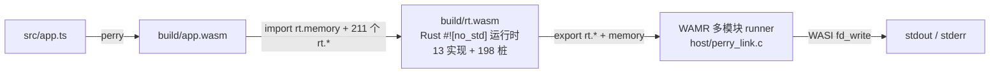

# 把 TypeScript 编译成 wasm，塞进 WAMR 里跑起来

目标是验证一件事：perry 的 wasm 后端产出的模块，换一套宿主实现还能不能跑出同样的结果。perry 自带的那套宿主层是 JS 写的（`@typerry/node` 的 README 自称 platform-independent ES module runtime，Node / Bun / 浏览器都能用）。结论是能跑，两边输出逐字节一致——而且现在跑它的宿主只剩 WASI：`rt.*` 运行时也用 Rust 编成了独立的 wasm 模块（`runtime-wasm/`，`#![no_std]`），和业务模块一起由 WAMR 多模块机制链接执行（路线三，见"架构（实测）"一节）。

这版 demo 走通了当初那条"正确的路线"：把 perry 的 Rust 运行时源码按 wasm 目标编译，让运行时跟着产物一起分发。前面用 C 写宿主（路线一，探针）的经历保留为历史背景——它的价值在于把宿主边界和 `rt.*` ABI 测了出来。

```bash
./demo.sh
# PASS: WAMR 输出与 perry JS 宿主层完全一致
```

## 想回答的问题

TypeScript 交付一直有个别扭之处：**交付即交付源码**。打包、压缩、source map 加不加都一样，只是读起来费点劲。编译成原生二进制能解决这一点，但代价是把"一次编写、到处运行"换成"一次编写、到处编译"——每个 OS / CPU / ABI 组合各出一份产物，交叉编译矩阵很快失控。

wasm 看上去是第三条路：产物是平台无关的字节码（一次分发），运行只需要一个解释器（到处运行）。这条路对 TypeScript 打不打得通，就是这次探索要回答的事，拆成两问：

1. **源码还暴不暴露**：产物里是不是只剩字节码，没有可读的源码语义；
2. **"到处运行"还剩多少**：wasm 本身平台无关，但 perry 的产物声明了 211 个 `rt.*` 导入，宿主全部实现它才肯实例化。这些运行时语义（字符串、对象、数组、闭包、GC）是必须每个平台重写一遍，还是能跟着 wasm 一起分发。

第 2 问才是关键。如果这些导入只能由宿主逐个实现，"到处运行"实际就是"到处写一套运行时"，源码保护的好处也被稀释——你只是把分发物从源码换成了字节码，运行时那一摊照旧。

结论先说：源码保护大体成立（有折扣，见文末"代价"）；"一次分发"成立的前提是**把 perry 的 Rust 运行时也编译成 wasm，跟业务模块一起分发**，宿主只留 WASI 那点系统能力。这条路已经走通（路线三）：`rt.*` 由 `runtime-wasm/`（Rust `#![no_std]`）编成独立 wasm 模块，业务模块 import 它的 memory 和 211 个 `rt.*` 函数，WAMR 多模块链接执行，`./demo.sh` 6/6 步 PASS、正向逐字节一致。前面用 C 重写 13 个导入的探针（路线一）把宿主边界测了出来——ABI、字符串表契约、动态分派，全是从官方宿主层插桩读出来的；它也证明"换一个语言重写一遍运行时"不是答案：成本随程序用到的语言特性线性增长，换成用数组的程序，立刻报错。

下面按踩坑的顺序记一遍，包括我一开始判断错的地方。

## perry 是什么

[perry](https://github.com/PerryTS/perry) 是 Rust 写的 TypeScript/JavaScript 编译器，走 SWC 解析加 LLVM 后端，主要产物是原生可执行文件。它的 wasm 后端被抽出来单独发了个 npm 包 [`@typerry/node`](https://github.com/fn-a/typerry)，内部链路是 SWC → 自研 HIR → wasm codegen，用 napi-rs 暴露给 JS，零运行时依赖。

这决定了整件事的形态：perry 出的 wasm 不是"裸算法模块"，而是一个完整的程序。它导出 `_start` 和 `memory`，程序入口在启动时就把整个业务逻辑跑完。

## 第一个坎：包根本装不上

`npm i @typerry/node` 装到的是 0.0.3。装完一跑：

```
Error: Cannot find module '@typerry/node-linux-x64-gnu'
```

napi-rs 的套路是主包 + 平台包分离，0.0.3 的 `optionalDependencies` 里点名了六个平台包，但 registry 上只有 `@typerry/node-linux-x64-gnu@0.0.2`，0.0.3 的 404。主包自己不带 `.node` 文件，39.9 kB 的空壳。

降到 0.0.2 两个包都能装上（平台的从 `registry.npmjs.org` 手动取 tarball，我用的 npm 镜像没同步这一层）。这种"主包发了、平台包忘了发"的发布事故在 napi-rs 项目里不算罕见，判断方法很直接：`npm view` 主包看 `optionalDependencies`，再去 `npm view` 每个平台包。

## 第二个坎：CLI 是哑的

按 README 走 `typerry input.ts --bare`，输出是空的。没有报错，没有文件，退出码 0。

看了看 `main.js`，它靠 `process.argv[1]` 和 `import.meta.url` 比对来判断"是直接执行还是被当库引入"，而 `node_modules/.bin/typerry` 是个软链，两边路径对不上，于是 CLI 主体根本不执行。直接 `node node_modules/@typerry/node/main.js` 就好了，但没必要绕——用库 API 更干净：

```js
import { wasmBare, wasmBoot } from '@typerry/node';
const wasm = wasmBare(source);              // 裸 wasm
const ref  = wasmBoot(source, '', true);    // wasm + perry 自带的 JS 宿主层
```

顺便说一句，`wasmBoot` 产出的那份 112 KB 的 JS 宿主层后来成了整个项目最有价值的东西，理由见下一节。

## 第三个坎：211 个未满足的导入

裸 wasm 拿到手先看结构：

```
Export:  _start / memory / __indirect_function_table / ...
Import[211]: 
 - func[0] sig=1 <rt.string_new> <- rt.string_new
 - func[1] sig=2 <rt.console_log> <- rt.console_log
 ...
```

211 个导入，全挂在 `rt` 模块上：字符串、console、Math、JSON、Date、Map/Set、Buffer、crypto、fetch……perry 把整个运行时接口一次性声明进去了，**不管你的程序用不用**。WAMR 实例化时要求全部导入可解析，少一个都不行。

也就是说，想让它跑起来，宿主侧必须把这 211 个函数**全都提供出来**，哪怕只有三个真的会被调用。

## 怎么知道这些函数该实现成什么

这是整件事最关键的一步。`rt.*` 的调用约定是 perry 内部的，没有文档：值怎么编码、字符串怎么传、返回值写在哪，全靠猜的话得试到天荒地老。

好在 perry 自带的那套宿主层就是现成的参考实现——`buildImports()` 里那一段 JS 就是这 211 个函数的精确定义。于是我把它的 `mem_call` 插了一行打印：

```js
const coreFn = __memDispatch[name];
// 上面插一行:
process.stderr.write(`MEMCALL ${name} args=${JSON.stringify(args)}\n`);
```

跑一遍就拿到全部事实：

```
MEMCALL js_add args=[6764,4181]
MEMCALL js_add args=["fib(0..19) sum = ",10945]
MEMCALL console_log args=["fib(0..19) sum = 10945"]
```

一个 20 行的程序，真正用到的导入只有三个：`string_new`、`mem_call`、`mem_call_i32`。所有动态调用（字符串相加、console 输出、`.length`）都收敛到 `mem_call` 这一个入口。剩下的 200 多个导入在实例化时被解析，但一辈子不会被调用。

这个技巧值得单独记住：**当你没有规范、但有一个能跑的参考实现时，别读源码猜，插桩打印。** 我一开始想靠读 wat 反推参数含义，看了半小时 `i64.const 9223090561878065386` 也不知道那是什么；插一行 print 两分钟就全清楚了。

## ABI 长这样

从宿主层源码里读出来的约定：

**值编码**是 NaN-boxing，f64 位模式，跨宿主边界按 i64 传：

| 值 | 位模式 |
| --- | --- |
| `undefined` / `null` / `false` / `true` | `0x7FFC…0001` ~ `0x7FFC…0004` |
| 对象/数组/闭包（handle） | 高 16 位 `0x7FFD`，低 32 位是 handle id |
| int32 快路径 | 高 16 位 `0x7FFE` |
| 字符串 | 高 16 位 `0x7FFF`，低 32 位是字符串表下标 |
| 其他 | 就是普通 double |

**字符串表**是隐式契约：wasm 启动时按固定顺序逐个调用 `rt.string_new(offset, len)` 注册字面量，宿主必须按同样顺序 append，下标即 id。两边计数错一位，所有字符串就全乱了。桥接函数名也在这张表里，`mem_call` 的第一个参数就是名字的下标。

**动态调用协议**：`mem_call(nameId, argc, base)`，参数以 u64 槽位写在 wasm 线性内存 `base` 处，返回值也写回 `base`（函数本身返回 0.0 当占位，宿主层源码注释里明说了这点）。`mem_call_i32` 一样，只是结果直接作为 i32 返回、不写内存。为什么不直接按 f64 传参、非要绕一趟内存，源码没解释；我的判断是 f64 过 FFI 边界时 NaN 位模式有被规范化的风险，两边都按 u64 读写原始位模式最稳。

## 宿主侧：为什么用 `--native-lib`（路线一·探针，历史背景；当前 demo 已改走路线三，见"架构（实测）"）

WAMR 给宿主函数有两条路。一是写个自定义 runner，链接 `libiwasm.a`，调 `wasm_runtime_register_natives()`；二是编译成 `.so`，导出 `get_native_lib()`，让 `iwasm --native-lib=xxx.so` 自己 dlopen。

选后者，因为不用维护 runner 代码，命令行就是最终形态：

```bash
iwasm --native-lib=build/libperry_rt.so build/app.wasm
```

代价是两个不写出来根本想不到的坑。

**坑一：导出的符号。** iwasm 默认不导出自己的符号，dlopen 进来的 `.so` 一调用 `wasm_runtime_set_exception()` 就挂。构建 iwasm 时得加 `-Wl,--export-dynamic`：

```bash
cmake -S .../product-mini/platforms/linux -B .deps/wamr-build \
  -DWAMR_BUILD_INTERP=1 -DWAMR_BUILD_FAST_INTERP=1 \
  -DWAMR_BUILD_AOT=0 -DWAMR_BUILD_JIT=0 \
  -DCMAKE_EXE_LINKER_FLAGS="-Wl,--export-dynamic"
```

**坑二：`WASMExecEnv` 不是公开类型。** 原生函数第一个参数是 exec env，WAMR 文档和示例里写作 `wasm_exec_env_t`（公开 typedef），而 `WASMExecEnv` 只存在于内部头文件。照着印象写 `WASMExecEnv *exec_env`，gcc 直接一片 `unknown type name`。

原生函数的签名约定：第一个参数固定是 exec env，其后与 wasm 导入签名一一对应；`NativeSymbol` 里的 signature 字符串（`"(II)i"` 这种，`I` 是 i64、`i` 是 i32、`F` 是 f64）填 NULL 就跳过校验，填了 WAMR 会拿它跟 wasm 导入类型比对。

## `rt.*` 为什么不是 WASI

看到"每个宿主都要实现 211 个导入"，第一反应是：为什么不用 WASI？那样任何 wasm 运行时都能跑，何必自己写宿主。

因为两者不在同一层。WASI（preview1）给的是系统调用级接口——`fd_write`、`clock_time_get`、`random_get`、`path_open`，形态统一成"(指针, 长度, …) → errno"，操作对象是字节缓冲和资源句柄。`rt.*` 给的是**语言运行时**：字符串表、NaN-boxed 值的编解码、对象/数组的 handle store，还有一个按名字动态分派的 `mem_call` 入口。WASI 里没有"字符串"这个概念，也没有堆对象、属性和原型链。

三处硬冲突：

1. **签名只描述位宽，不描述语义。** 211 个导入只用到 16 种类型，且绝大多数长这样：`string_len: (i64) -> i64`、`string_concat: (i64, i64) -> i64`、`console_log: (i64) -> ()`。i64 里装的是 f64 的位模式（高 16 位是标签），返回值也是位模式——wasm 的类型系统只看得到 i64，看不到"这是字符串 id 还是 number"。WASI 的接口是强类型加资源语义，套不上这套私有编码。
2. **动态分派靠运行时查表，不是静态导入。** perry 把所有动态操作（字符串相加、console 输出、`.length`，以及将来的属性访问）都收敛进 `mem_call`：第一个参数是函数名在字符串表里的下标，宿主拿名字去 `__memDispatch` 查表再调。WASI 的导入是编译期定死的符号，中间没有"名字 → 实现"这一层。硬要做成 WASI 兼容，就得在 WASI 之上再实现一个分派器——那等于在 WASI 里重建 perry runtime，WASI 只当搬运工。

还有一层工程动机：perry 的 runtime 语义要同时服务 native 后端和 wasm 后端。把 `rt.*` 定成"wasm 导入 + 宿主实现"，换来的是同一套语义可以有 Node 版宿主、C 版宿主、Rust 版宿主。但要注意，native 后端并不需要宿主——它把 `libperry_runtime.a` 静态链进可执行文件；宿主实现只是 wasm 后端的选择，而这一选择把成本推给了每一个用户。

所以准确的说法不是"不能 WASI 兼容"，而是 **WASI 在 `rt` 的下面一层**：`rt` 是语言运行时，WASI 是系统调用。要让产物跑到任何 WASI 运行时上，得把 `rt` 的实现也变成 wasm 的一部分——不是用 C 或 QuickJS 再写一遍，而是把 perry 自己的运行时源码按 wasm 目标编出来。具体怎么拼见下一节。

这次的程序本身是纯计算，业务模块一个系统调用都不需要；但路线三里运行时模块的 console 输出走 `fd_write`——"WASI 在 `rt` 的下面一层"这个判断被直接验证了：`rt` 语义由运行时模块实现，WASI 只负责把字节送到 stdout。

## 架构（实测）：路线三——运行时 wasm 模块 + WAMR 多模块链接

前面那套 C 宿主是探针，不是终点。答案其实写在 perry 自己的代码结构里：

- `crates/perry-runtime` 是 Rust 写的运行时（GC、JSValue、内置对象、字符串），`crates/perry-runtime-static` 把它打成 `libperry_runtime.a`，native 后端的 `perry compile` 直接把这个静态库**链进可执行文件**。运行时从始至终就不是"宿主契约"，而是源码。
- `crates/perry-codegen-wasm` 的模块注释是另一句话：*Runtime operations (strings, console, objects) are imported from JavaScript.* —— wasm 后端把运行时交给了 JS 宿主层（这样才生得出"自包含 HTML + base64 wasm"），211 个导入和"每个宿主都得实现一遍"的问题就是从这儿来的。

所以正确做法不是换个语言把运行时重写一遍，而是**把同一份 Rust 运行时按 wasm 目标编译，跟业务模块一起分发**。业务代码、`rt.*` 的调用约定、codegen 都不动，变的只是这些导入由谁提供：不再是宿主进程里的手写实现，而是交付物内部的另一个 wasm 模块（或同一模块里的函数）。

组装路线按改动量排（前两条是历史/未实施，第三条是当前实现）：

1. **路线一·C 桥接（`libperry_rt.so`，探针，已废弃为历史背景）。** 用 C 在宿主里手写 `rt.*`，`iwasm --native-lib` dlopen。见前文"宿主侧：为什么用 `--native-lib`"。它把 ABI 测了出来，但成本随用到的语言特性线性增长。
2. **路线二·AOT 内联（静态链接成单模块，未实施）。** `wasm-ld` 把运行时 wasm 静态库与 codegen 输出链成单个模块，与 native 路径同构；要 codegen 产出可重定位对象，或让链接器把 import 解析成本地符号。另有 Component Model（WIT 声明 `rt` 接口），接口最干净，但 canonical ABI 的 lift/lower 与这套"f64 位模式 + 线性内存槽位"零拷贝约定冲突，WAMR 支持也弱，最不成熟。
3. **路线三·运行时 wasm 模块 + WAMR 多模块链接（当前实现，已实测）。** runtime 编成独立 wasm 模块，导出同名的 `rt.*` 函数和 memory；业务模块 import 它（`--import-memory`），一个字节都不用改；宿主只把两个模块接起来，剩下只有 WASI。本 demo 走的就是这条。



**为何走得通**：211 个 `rt.*` 签名只用到 i32/i64/f32/f64，指针就是业务线性内存偏移，跨模块没有"类型不匹配"这一层；运行时模块 import 业务那块内存后，`mem_call`/`string_new` 直接读写同一块内存，零拷贝约定原样成立。

**三要点**：① 业务模块 `import rt.memory`——`tools/patch-app-memory.mjs` 把 memory 段改成 import（同一块线性内存只有一个定义者）；② 运行时模块导出 memory——`runtime-wasm/.cargo/config.toml` 用 `--global-base=2097152` 把自己的 data/bss/stack 放到 2 MiB 以上，避开业务模块低地址区；③ 211 个导入里没实现的 198 个不是运行时查表，而是**编译期就生成的桩函数**——`tools/gen-rt-symbols.mjs` 从 `app.wasm` 导入段生成 `build/rt_symbols.rs`（`lib.rs` 用 `include!` 引入），桩调用即写 stderr `bridge function 'xxx' is not implemented` 后 `unreachable()` trap。

**实测**：`./demo.sh` 6/6 步 PASS；正向（Rust 运行时模块 vs perry JS 宿主层）逐字节一致，5 行输出；负向（用数组的程序）报 `bridge function 'array_new' is not implemented`、退出码 1。产物：`app.wasm` 10650 B、`app_link.wasm` 10658 B、`rt.wasm` 16798 B。WAMR 2.4.3，构建需 `WAMR_BUILD_MULTI_MODULE=1`、`WAMR_BUILD_LIBC_WASI=1`、`WAMR_BUILD_TARGET=X86_64`。

运行时模块自己不带 libc，标准输出/错误只用到 `wasi_snapshot_preview1.fd_write` 这一个 WASI 调用（见 `runtime-wasm/src/lib.rs` 的 `write_fd`）；宿主无需自定义 stdout 缓冲，`perry_link.c` 只调 `wasm_runtime_set_wasi_args(rt, …)` 让 rt 的 fd_write 落到 stdio。

**路线三踩的两个坑**：

- **坑一：memory import 的 `min` 页数必须 ≤ 运行时模块实际可用页数。** 实测 `patch-app-memory.mjs` 给业务模块加 import 时 min=1 能过，min≥2（含 17/18/64/100）全挂，实例化即报 `failed to link import memory (rt, memory)`、退出码 1。根因是 WAMR 对运行时模块的 init memory 有收缩记录，业务模块声明的 min 一旦超过它就 link 失败。
- **坑二：WASI 参数要配在打日志的模块（rt）上、早于实例化。** 打 `fd_write` 的是运行时模块，`wasm_runtime_set_wasi_args(rt, …)` 因此调在 rt 上；`perry_link.c` 的顺序是 load rt → register → set_wasi_args → load app → instantiate。时机错位（实例化之后才补 WASI）在开了 WASI 线程支持的构建里会报 `initializing thread failed!`〔条件性，本 WAMR 2.4.3 构建未开该选项，未复现〕。

未覆盖的部分仍在宿主边界外：`perry-runtime` 里的 `fs`/`dns`/`dgram`/`child_process`/`cluster`/`net`/`atomics`+`futex`/`macos_bundle` 这些 OS 强耦合模块，wasm 目标要么走 WASI（socket 还在提案），要么不编进去——这部分任何方案都省不掉。分配器不受影响（mimalloc 受 `#[cfg(target_pointer_width = "64")]` 限制，wasm32 自动落回系统分配器）。好消息是裁剪机制现成：perry 的 auto-optimize 已会按程序实际用到的特性重建运行时子集（`optimized_libs.rs`），wasm 化无非加一个 wasm 目标预设。

收益也直接：`mem_call` 从"跨边界查表 + 内存槽位往返"变成模块内的函数调用，导入面从 211 个私有函数缩到十来个 WASI 标准调用——"一次分发"在这条路上已经成立：分发一个自包含的 wasm，跑到任何有 WASI 运行时的地方。

## 让 211 个导入全都有主

逐个人肉写 198 个用不上的桩，这活没人想干，而且 wasm 一重新编译就可能漂移。写个生成器从导入段直接生成，源文件里已定义 `rt_<名字>` 的进符号表，其余的生成"调用即抛异常"的桩：

```
build/rt_symbols.rs: 211 个 rt 导入 (已实现 13, 桩 198)
```

已实现的 13 个覆盖数字、字符串、console：`string_new`、`mem_call`、`mem_call_i32`，加上十个桥接函数（`js_add`、`console_log`、`string_len`、`string_concat`……）。这 13 个实现在 `runtime-wasm/src/lib.rs`，桩由 `include!("../../build/rt_symbols.rs")` 进同一个模块。

关于桩，有个刻意的选择：**不返回假数据，直接抛带函数名的异常。**

```
$ ./build/perry_link build/arr_link.wasm build/rt.wasm
Exception: bridge function 'array_new' is not implemented
execute _start: Exception: unreachable
```

用数组的 TS 程序就是上面这个结果，退出码 1。比起悄悄返回 `undefined` 让程序带着坏数据往下跑，这样至少你知道边界在哪。

## 跑起来是什么样

```
fib(0..19) sum = 10945
Hello, WAMR!
msg.length = 12
string compare ok
template: Hello, WAMR! (sum=10945)
```

同一份 `app.ts`，`build/app.wasm` 10650 B、`build/app_link.wasm` 10658 B、`build/rt.wasm` 16798 B，宿主 runner `build/perry_link`，两边输出 `diff` 干净。

## 边界

对象、数组、闭包、类一概没有——那需要把 perry 的 handle store 在运行时模块里重做一遍，包括原型链、属性查找、GC 语义。为一个 demo 做这个是亏的，所以停在这里，让它报错。

真要往前走，扩展路径是清楚的：在 `runtime-wasm/src/lib.rs` 里实现 `rt_array_new` 之类的函数（路线一时是往 `host/perry_rt.c` 加实现、或往 `g_bridges[]` 加一条）。符号表是生成的，不用手工登记——`gen-rt-symbols.mjs` 重跑一遍，新函数从桩变成实现。

不过这条路本身不值得一路走到底：把 perry 的运行时语义手写重做一遍（无论 C 还是 Rust），等于重写 `perry-runtime`，还得跟着上游 ABI 走。路线一的 C 版写它的目的只有一个——把宿主边界测清楚；路线三换成 Rust 运行时模块后，扩展方式随之变成在 `lib.rs` 里加实现，但"完整 JS 语义要补的量级"这个结论没变。

## 代价

**源码保护是有折扣的。** wasm 不是加密，`wasm2wat` 就能把产物摊成可读文本：函数结构、字符串常量、导入名都在。这次生成的 198 个桩，名字（`array_new`、`json_parse`、`fetch_url`……）直接来自 wasm 导入段，一个不漏——它们顺带把"这个程序会碰哪些运行时能力"标了出来。真要用它保住商业逻辑，该藏的还得另外藏（混淆、把关键逻辑留在服务端、自定义宿主 + 加密段），它做到的是把门槛从"打开源码"抬到"反编译一遍再读"。

不过有一点比预期好：看了下 `app.wasm` 的段表，没有 name 自定义段（只有 type / import / func / table / memory / global / export / element / datacount / code / data 十一个），函数名和局部变量名都不在产物里，`strings` 能捞出来的标识符全是程序自己的字符串字面量。也就是说 debug 名字没泄漏，泄漏的是字面量和导入名。

**成本被搬错了地方。** 前半段写的那种做法——每个平台实现一套 `rt.*` 宿主——是在正确的方向上用错误的方式解决：这次实测的量级是，纯原始值的程序 13 个实现够用，碰到数组立刻报错；要把完整 JS 语义（对象、原型链、闭包、GC、异步）补齐，等于把 `perry-runtime` 在 C 里重写一遍，成千上万行，还得跟着上游 ABI 走。这种活不该由每个用 perry 的人各干一遍。

正确的成本结构是：**一次性把运行时移植到 wasm 目标**（裁剪 OS 耦合模块、加 wasm 预设），然后所有产物共享它，宿主侧只剩 WASI——这条路（路线三）已经走完：`runtime-wasm/` 把 13 个实现编进 `rt.wasm`（16798 B），宿主只剩 `fd_write` 一个 WASI 调用，`./demo.sh` 6/6 步 PASS。

至于适用场景，运行时进 wasm 之后答案更清楚了：**宿主自己可控、语言子集能裁剪**的地方——嵌入式设备上的规则脚本、算得多的插件、既不想源码外流又不想放弃 TS 写法的内部交付。反过来，把用满 npm 生态的应用搬过来，要解决的首要问题不是源码保护，而是运行时要补多少。

## 复盘

最值钱的一步是拿 perry 自带的宿主层当 oracle。三个问题一次解决：ABI 有了权威定义、行为有了可比对的基准、`demo.sh` 最后那个 `diff` 也就顺理成章。逆向一个没文档的 ABI 时，找到一个能跑的同族实现，比读三天源码快得多。

其次是那句"211 个导入必须全部解析"。我一开始以为可以按需实现，直到 WAMR 拒绝实例化才明白：声明和调用是两回事，链接是声明级的。生成器与其说是偷懒，不如说是被这条规则逼出来的。

最后，perry 本身在这个场景下的表现还行——wasm 后端不需要 LLVM（typerry 的 Cargo.toml 里只有 parser / hir / codegen-wasm / codegen-js 四个内部 crate）、编译 10 KB 的 wasm 只要零点几秒、宿主侧只要求把 211 个导入实现出来，谁写都行（我的 C 版和它自带的 JS 版跑出同一份输出，靠的就是这一点）。但这条"谁写都行"恰恰指出了它缺的东西：native 后端会把 `perry-runtime` 链进可执行文件，wasm 后端却把运行时甩给了宿主，于是每个用户都得自己补一遍——所以有了路线三：把 perry 的 Rust 运行时编成 wasm 模块（`runtime-wasm/`），宿主只剩 WASI，`./demo.sh` 6/6 步 PASS、正向逐字节一致、负向 `array_new` 报错。这一块补上了。其余的都是生态问题：0.0.3 的发布事故、没有文档的 `rt` ABI、CLI 的入口判断 bug——想在生产里用，…

